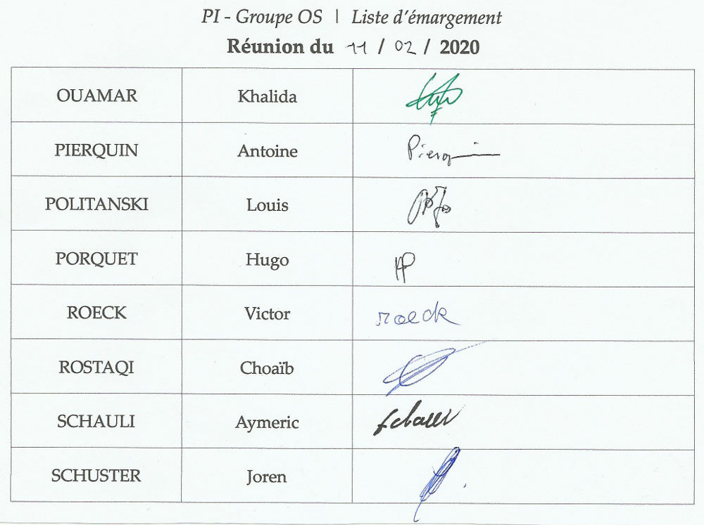

# PI - Groupe OS | Compte-rendu de réunion - 11/02/2020

- **Type  :**  Séance dédiée #04

- **Date  :**  Mardi 11 février 2020

- **Heure :**  13h30 -> 17h (3h30)

- **Lieu  :**  UFR, Salle T24

- **Membres présents :** Tout le monde

------------------------------------------------------

### [Ordre du jour - "Planning" de la réunion]

- **Récapituler l'état actuel du projet et les avancements de chacun** depuis la dernière réunion. Revenir sur le document donné par les enseignants concernant le rôle du chef de projet.

- **Discuter de certains points concernant l'ensemble du projet**, avec tous les membres, notamment l'outil permettant de "remplir" les heures.

- **Travail en équipes** pour le reste de la séance : suite du travail de spécification (noyau, réseau) et de développement (interface graphique).
**Discuter de certains points concernant des parties spécifiques**, avec les membres des équipes concernées.
Travail du chef de projet avec les différentes équipes.

------------------------------------------------------

## 1. Déroulement de la réunion

### 1.1. Démarrage de la séance (13h30)

- **Présentation de l'ordre du jour** à tous les membres (*cf* section précédente), explications de ce qui va être fait pendant cette réunion.

- **Récapitulatif de l'état actuel du projet** : spécification du noyau et du réseau en cours ; développement de l'interface graphique pas mal avancé.

- **"Tour de table"** pour faire le bilan des avancées de chacun depuis la dernière réunion.
*Note: Bien qu'il soit membre de l'équipe réseau, Antoine a travaillé la BDD car le travail de spécification ne pouvait être fait à deux avec Khalida au cours des jours précédents. Il a donc proposé, en attendant, d'avancer la réflexion concernant la BDD, proposition qui a été acceptée.*

    * (Khalida) réseau : envoi et réception de message, début de la partie serveur

    * (Antoine) BDD : schéma et réflexion sur les requêtes en fonction des besoins

    * (Choaïb) réflexions concernant le noyau et les structures de données

    * (Louis) avancement dans le noyau concernant les structures de données, mais pas encore d'interface ni de logique

    * (Hugo, Aymeric) formation et expérimentations sur Unity3D/C#, réflexions sur la gestion du plateau

    * (Victor) poursuite du développement de l'interface graphique, début d'implémentation de certains éléments *in-game* "statiques" (non liés au noyau)

    * (Joren) réflexions sur l'outil pour remplir les heures (*cf* section 1.2. de ce CR) et sur l'organisation des prochaines semaines, recherches et réflexions concernant l'ensemble du projet ou des parties spécifiques (*cf* sections 1.2. et 1.3. de ce CR), début de formation sur Unity3D/C#

- **Rappel** de ce qui doit être fait **pendant cette réunion** et des **suites à donner** pour le projet au cours des prochains jours : poursuite du travail de spécification (noyau, réseau) et de développement (interface graphique)

- **Retour**, par Joren, sur :

    * Le **document donné par les enseignants concernant le rôle du chef de projet** ; rappel que les questions, remarques, suggestions, difficultés ou critiques sont les bienvenues, à tout moment

    * La **liste d'émargement à chaque réunion**, demandée par les enseignants. Joren éditera une liste "vierge" pour chaque réunion, qui sera ensuite signée au début de celle-ci par tous les membres présents. Chaque liste d'émargement sera conservée par lui, et, dans l'idéal, sera scannée afin qu'elle soit mise en annexe du CR de la réunion dont il s'agit.

- Bref **échange avec M. DECOR** et obtention de quelques informations :

    * concernant les dates et échéances, à priori : le rendu des documents tels que le rapport final aura lieu la semaine du 04/05; la soutenance et la présentation de nos résultats aura quant à elle lieu la semaine du 11/05

    * accord pour utiliser un *GoogleSheets* pour récapituler nos heures

    * quelques informations concernant le contenu qui sera attendu pour le rapport final

---------------------------

### 1.2. Discussions concernant l'ensemble du projet (\~ 14h)

- Retour sur l'**outil pour remplir les heures**

    * Proposition par Joren de plusieurs possibilités pour la mise en forme, le format, les conventions du *GoogleSheets*. Discussion avec tous les membres afin que l'outil puisse convenir à tout le monde, et accord sur ce qui sera mis en place.

    * Le *GoogleSheets* sera créé par Joren d'ici à la prochaine réunion. La description du fonctionnement, une légende et les besoins seront détaillés dessus.

    * **Chaque membre sera chargé de remplir ses heures**, semaine après semaine

- Discussions concernant la **documentation**

    * La documentation du code pourra être réalisée en utilisant des commentaires **Doxygen**. Il nous sera également possible d'utiliser des commentaires **XML** en plus, sachant que Doxygen supporte les commentaires en XML (à voir selon l'utilité)

    * La documentation pourra être générée directement via Doxygen. Dans le cas où nous utiliserions également des commentaires en XML, des outils spécifiques pour la génération pourront également être utilisés (par exemple SandCastle)

    * Les **commentaires utiliseront le format ///** (triple slash)

- Retour sur les **recommmendations / standards liés au C# et à Unity** : pas vraiment de "bonnes pratiques" spécifiquement liées à ces technologies. Par ailleurs, nos conventions pour le "nommage" (variables, fonctions...) ont déjà été définies.

- Précisions concernant les **plateformes** que nous utilisons :

    * **Trello**

        - Le Trello sera "passé en revue" d'ici à la prochaine réunion : création des cartes nécessaires et mise à jour des rôles et affectations

        - Bon nombre de mises à jour seront faites par le chef de projet, dans la mesure du possible, cela permettant notamment à tout le monde d'avoir davantage une vision globale du projet

        - Il nous faudra consulter cet outil **régulièrement**

    * **Discord**

        - Les salons seront "rafraichis" d'ici à la prochaine réunion (suppression du salon "regles-du-jeu" par exemple), et des salons spécifiques seront mis en place (pour le noyau, l'IG...)

        - Tous les liens utiles seront rassemblés à un même endroit pour faciliter leur accès : Trello, Git, GoogleSheets...

        - **Mise en place d'un bot Discord** annoncant les **commits sur le GitLab, les merge requests et les nouvelles issues** sur un salon dédié.
        Cela permet d'être tenu au courant de ces différentes informations et nouveautés automatiquement, et de manière plus pratique qu'en allant consulter directement le GitLab.

    * **GitLab**

        - Concernant la structure actuelle des dossiers (au niveau du jeu), l'organisation est correcte. Cette dernière sera remodelée si besoin pendant les premières phases de développement.

        - La gestion des éventuels conflits au moment des merges se fera en fonction de la situation et du problème, entre les membres / équipes concernées et avec le chef de projet.

        - Mise en place de **conventions pour les commits** : **indiquer la partie concernée par le commit** (ex: noyau, IG...) en début de nom **et** faire suivre par **la modification effectuée** (ex: ajout d'une fonctionnalité, résolution de bug...)
        Exemple : *[Noyau] Ajout logique distribution des cartes*

        - Rappel de **principes de précautions** : récupérer les modifications avant d'en push de nouvelles ; ne pas travailler sur un même document au même moment ; lors d'un merge, en cas de conflit : annonce aux membres des équipes concernées...

---------------------------

### 1.3. Travail en équipes et précisions de certains points spécifiques (\~ 14h20)

La suite de la séance a consisté à **poursuivre notre travail** de spécification et de développement de l'interface graphique, **en équipes**, selon la répartition déterminée pour le moment (équipes noyau, IG, réseau).

Cela a aussi été l'occasion de **préciser, avec les membres des équipes concernées, des points** relatifs à certains aspects du développement, qui étaient restés indéterminés jusqu'à présent (*cf* liste ci-dessous).

- **Capacités de l'IA**

    * dans un premier temps, développement d'une IA "très basique" : se contente de "jeter les dés", ne fait pas d'échange, pose des constructions en fonction des ressources dont elle dispose mais sans avoir de stratégie

    * par la suite, développement, si le temps et les capacités le permettent, d'une IA plus évoluée : en plus du jet de dés, elle pourrait gérer les échanges, poser des constructions en disposant d'une logique (prise en compte dans les décisions des points de victoire apportés, éventuellement des positions...)

- **"Emplacement" de l'IA**

    * l'IA doit être disponible pour un client souhaitant faire une partie en local (dans ce cas, l'IA est gérée côté client), mais elle doit aussi être disponible pour une partie en ligne (si des bots sont demandés lors de la création de partie). Cependant, nous ne développerons pas côte à côte deux modules disctincts (un côté client et un côté serveur), pour des raisons évidentes de maintenabilité du code, sachant que de plus les IA pour une partie en local ou en ligne seront vraisemblablement assez similaires.

    * le module IA se trouvera donc du côté serveur, mais chaque client disposera en quelques sortes d'une "copie" (côté client), lui permettant de pouvoir faire des parties en local

    * **à rediscuter** : "récupération" du module côté client depuis le côté serveur lors d'un premier lancement du jeu ? en cas de mise à jour du module IA (côté serveur), comment se passe la récupération ?

- **Déconnexion d'un joueur lors d'une partie en ligne**

    * principe du fonctionnement : si un joueur est détecté comme étant déconnecté, et qu'1 minute après (temps mis par exemple), il est toujours détecté déconnecté : le joueur est "sorti" du jeu

    * l'objectif est qu'une IA puisse prendre en charge la partie d'un joueur qui se déconnecte, ou est déconnecté, afin que cela impacte moins les autres joueurs qui participent au jeu

    * **à rediscuter : possibilité de reconnexion** : un joueur déconnecté peut-il se reconnecter ou lui est-il impossible de se reconnecter à la partie en cours ? Il faut aussi revoir ces situations vis-à-vis de l'IA (si le joueur peut se reconnecter, l'IA qui avait pris en charge sa partie doit alors lui redonner la main)

- **Chat textuel** et éventuel "spam" : nous ne prévoyons pas, pour le moment, de fixer une durée minimale entre 2 messages (ex: 1 seconde) pour ne pas limiter ou frustrer les joueurs. Nous effectuerons cependant des tests de "spam" pour voir si cela pose des problèmes d'affichage, de "saturation" niveau serveur, ou d'autres problèmes pour les utilisateurs. Nous déciderons ensuite si nous restons aussi permissifs ou non

- **Triche éventuelle**

    * chaque client aura sa copie du jeu. Dans le cas d'une partie en local (solo ou multi), cela ne pose pas de problème, puisque la partie est seulement gérée du côté d'un client en particulier

    * lors d'une partie en ligne, la partie sera gérée du côté serveur, et non par chaque client localement : c'est donc le serveur (plus exactement, un module noyau, côté réseau) qui s'occupera de gérer toute partie en ligne, de manière "centrale". À chaque action, des vérifications "conséquentes" seront donc effectuées par le serveur : si l'acquisition d'une ressource est possible, si les intersections et espaces sont respectés...

    * à priori, les mécanismes "anti-triche" ne seront pas nécessairement trop lourds à mettre en place si les modules noyau et réseau sont réalisés correctement

- **Création d'une partie de jeu en local**

    * dans le cas où nous développerions plusieurs "niveaux" d'IA (d'abord une basique, puis une plus développée), nous verrons si nous laisserons la possibilité de choisir entre une IA simple ou une IA plus poussée (dans ce cas, une zone dans l'écran de création de partie permettra de choisir) ou si l'IA poussée sera "imposée"

    * le fait qu'une partie en local soit solo ou à plusieurs sera déterminé automatiquement en fonction du nombre de joueurs sélectionnés (1 ou > 1)

------------------------------------------------------

## 2. Bilan

### 2.1. Ce qui a été fait, les décisions prises : où nous en sommes

Cette quatrième séance a permis de mettre au point de nombreux aspects du projet, qu'ils concernent le noyau, le réseau, l'interface graphique ou bien le projet dans sa globalité (documentation, outil pour les heures, gestion des plateformes).

Le travail de spécification avance bien et sera poursuivi dans les jours à venir, celui concernant le noyau est prioritaire et son implémentation pourra vraisemblablement débuter sous peu.
La réalisation de l'interface graphique progresse bien elle aussi.

Les discussions ont bien avancées et le travail que nous souhaitions faire a été réalisé. De plus, certains points (notamment pour la spécification du noyau et du réseau) demandaient une certaine réflexion, par rapport aux discussions du jour, avant de pouvoir être poursuivis et ré-abordés. C'est pour cela que nous avons mis fin à la réunion 30 minutes plus tôt.

---------------------------

### 2.2. Difficultés rencontrées

Cette séance n'a pas donné lieu à des problèmes particuliers. Les discussions ont été enrichissantes et elles ont permis d'arriver, pour tout les points abordés, à des mises au point ou compromis acceptés par les membres.
Les points à rediscuter seront à l'ordre du jour de la prochaine séance.

------------------------------------------------------

## 3. À venir : ce qui est prévu

### 3.1. Dans les prochains jours, pour chacun d'entre nous

Avant la fin de la séance, nous avons précisé le travail que nous comptons effectuer pour les jours à venir, d'ici à la prochaine réunion : 

- Antoine : travail sur la BDD et éventuellement sur l'IA

- Khalida : poursuite du réseau (gestion des évenements)

- Choaïb et Louis : travail sur le noyau

- Aymeric, Hugo et Victor : poursuite du travail de l'IG

- Joren : mise en place du *GoogleSheets*, MÀJ des guidelines, "passage en revue" des plateformes (*cf* section 1.2.), étude des avancements réalisés au niveau des modules noyau et réseau, formation et apprentissage en C#/Unity notamment

Nous tâcherons également de "remplir nos heures" pour les premières semaines du projet.

---------------------------

### 3.2. À la prochaine réunion (séance #05, mardi 18 février)

- Récapituler le travail réalisé jusqu'à présent + les avancées de chacun : noyau, réseau, IG, BDD mais aussi communications entre les modules

- Observation de notre situation par rapport au diagramme de Gantt initial

- Planification des 2 semaines qui suivront la réunion (la semaine suivante étant une semaine de congés)

------------------------------------------------------

## [Annexe - Liste d'émargement de la réunion]

{width=100% height=100%}
<!-- syntaxe spéficique Pandoc -->
