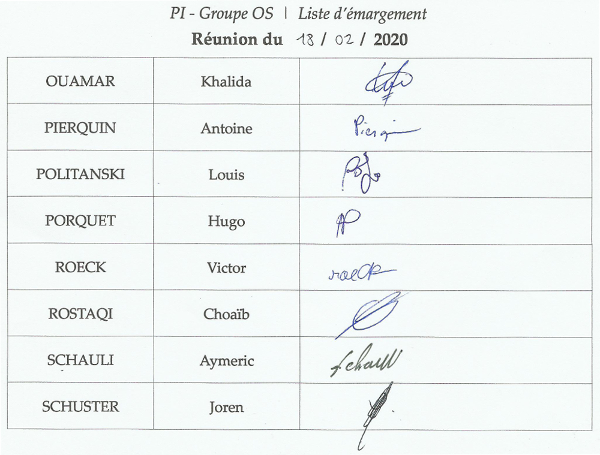

# PI - Groupe OS | Compte-rendu de réunion - 18/02/2020

- **Type  :**  Séance dédiée #05

- **Date  :**  Mardi 18 février 2020

- **Heure :**  13h30 -> 16h30 (3h)

- **Lieu  :**  UFR, Salle T24

- **Membres présents :** Tout le monde

------------------------------------------------------

### [Ordre du jour - "Planning" de la réunion]

- **Récapituler l'état actuel du projet et les avancements de chacun** depuis la dernière réunion, voir où on en est par rapport au diagramme de Gantt

- **Plannifier le travail pour les deux semaines à venir**, la semaine suivante étant une semaine de congés

- **Discuter de quelques points concernant l'ensemble du projet** : le GoogleSheets permettant de "remplir" les heures, le Git, retour rapide sur la documentation

- **Discuter de certains points concernant des parties spécifiques**, avec les membres des équipes concernées (notamment concernant le *in-game*)

------------------------------------------------------

## 1. Déroulement de la réunion

### 1.1. État actuel du projet et avancements (13h30)

- **Présentation de l'ordre du jour** à tous les membres (*cf* section précédente), explications de ce qui va être fait pendant cette réunion.

- **Récapitulatif de l'état actuel du projet**

    * **Noyau** : Spécification presque terminée, reste à traiter la communication avec les autres modules. L'implémentation est quant à elle bien avancée, il manque encore le contrôleur et la vue.

    * **Réseau** : Envoi et réception de messages possible, gestion des évènements

    * **IG**

        - Quasiment tous les menus sont réalisés (à l'exception notamment du menu d'attente dans un salon)

        - Le plateau de jeu peut être créé entièrement, soit en étant généré aléatoirement, soit en étant réalisé "à la main" par un joueur. 
        Il n'est pas possible à l'heure actuelle de faire "moitié/moitié", i.e. réaliser une partie du plateau à la main et finir la génération aléatoirement. Toutefois, ce n'est pas un point considéré comme étant prioritaire ni nécessairement utile (la question de son implémentation ou non sera reposée ultérieurement)

        - Pour ce qui est du jeu *in-game*, les éléments de base ont été créés : boutons fixes, accès au menu d'options, possibilité de quitter (éléments n'ayant pas de lien avec les autres modules)

    * **BDD** : Liste des requêtes bien avancée

    * **IA** : Début des réflexions

- **"Tour de table"** pour faire le bilan des avancées de chacun depuis la dernière réunion.
***Note**: Comme pour la semaine précédente, bien qu'il soit membre de l'équipe réseau, Antoine a travaillé la BDD car le travail de spécification du réseau n'avait pas d'intérêt à être fait en binôme avec Khalida au cours des jours précédents, du fait des fortes "dépendances" entre les fonctions et prototypes. Il a donc avancé la réflexion concernant la BDD et l'IA.*

    * (Khalida) Réseau : gestion des évènements, vérifications par rapport à la spécification du noyau

    * (Antoine) BDD : suite du travail sur les requêtes, réflexions sur la sécurité (// failles SQL)

    * (Choaïb) Noyau : travail sur le fonctionnement de la grille (le plateau de jeu)

    * (Louis) Noyau : structures de données (modèles) et fonctionnement (*Game & Player*)

    * (Victor) IG : mise en place de la possibilité pour le joueur de créer le plateau de jeu : soit en le générant aléatoirement, soit en le réalisant "à la main", tuile par tuile

    * (Aymeric) IG : aide concernant la génération du plateau

    * (Hugo) Noyau/IG : script du lancer de dés, ajout de pistes audio

    * (Joren) mise en place du GoogleSheets, "nettoyage" du Discord, réflexions sur l'organisation des prochaines semaines, un peu de formation en Unity3D et C#

- **Observation de notre situation par rapport au diagramme de Gantt initial** : au 18 février, l'état actuel du développement est satisfaisant et nous sommes plutôt dans les temps. Voici un bref récapitulatif de l'avancement actuel :

    * Le diagramme initial prévoyait :

        - noyau : spécification finie et implémentation commencée

        - réseau : spécification presque terminée et début de l'implémentation

        - interface graphique  : en cours de développement

    * À l'heure actuelle :

        - noyau : Spécification quasiment finie et implémentation commencée. La spécification n'est pas finie mais le sera prochainement, le plus gros est fait.

        - réseau : Spécification en cours, implémentation commencée. La spécification complète du réseau nécessite notamment que celle du noyau soit bien au point, d'où le fait qu'elle ne soit pas encore finie. Cela dit, une longue durée avait été initialement prévue pour l'implémentation du réseau, de plus ce module ne sera intégré que pour la version alpha (la "v2"). Le fait que sa spécification prenne davatange de temps n'est donc, pour le moment, pas trop un problème.

        - interface graphique  : En cours de développement, très bien avancée. Tous les menus sont réalisés et la réalisation du *in-game* a débuté

        - BDD (et également IA, dans une moindre mesure) : Déjà de bonnes avancées dans ce domaine (avance par rapport au planning sur ce point)

---------------------------

### 1.2. Plannification des deux prochaines semaines (\~ 14h05)

- Nous avons ensuite établi les **suites à donner pour le projet**, en **plannifiant le travail à faire pendant les 2 semaines à venir** (la semaine prochaine étant une semaine de congés).
Ce qui a été déterminé est décrit en section **3.1.** de ce CR.

- Aucune question, remarque, demande ou difficulté n'a été soulevée par les membres

---------------------------

### 1.3. Discussions concernant l'ensemble du projet (\~ 14h15)

- Avant de poursuivre les discussions, Joren a **récapitulé à M. DECOR** l'état actuel du projet ainsi que ce qui est prévu pour les deux prochaines semaines. Il lui a également présenté le GoogleSheets mis en place pour remplir les heures, qu'il a validé.

- Retour sur l'**outil pour remplir les heures**

    * présentation aux membres du **GoogleSheets** mis en place par Joren et explications sur la forme du document ainsi que son fonctionnement

    * principe : remplissage de chaque tâche et de la durée de travail associée par chaque membre, au fur et à mesure

    * utilisation d'une couleur spécifique pour chaque catégorie (ex : noyau, BDD, réunion...)
    *note : le code couleur utilisé reprend celui utilisé pour le diagramme de Gantt : cela permettra notamment une meilleure lecture du récapitulatif de suivi des heures aux côtés du diagramme de Gantt*

- Précisions "finales" concernant la **documentation**

    * commentaires avec **Doxygen** en utilisant des **`///`**

    * l'utilisation de balises XML, un temps envisagée, ne semble pas nécessaire

- Précisions rapides concernant notre **GitLab**

    * l'organisation des dossiers est correcte à l'heure actuelle (tout le jeu est regroupé dans `Catan/`)

    * évocation de la mise en place d'une potentielle organisation en branches sur notre Git : à priori, ce n'est pas nécessaire à l'heure actuelle

---------------------------

### 1.4. Discussions concernant des points spécifiques du projet (\~ 14h45)

- **"Emplacement" de l'IA**

    * la description faite au point 1.3. du CR de la réunion du 11/02 n'était pas tout à fait correcte : chaque client disposera d'un module IA (pour les *bots* des parties en local), et un module IA sera également situé côté serveur (pour les *bots* des parties en ligne)

    * dans la configuration envisagée actuellement, le module IA côté serveur pourra ainsi évoluer mais le module IA d'un client restera le même, à moins que celui ci n'obtienne une nouvelle version du jeu

- Détails d'une **partie *in-game*, en cours de jeu**

    * Une fonctionnalité permettant d'afficher, dans le chat, l'**historique des actions** qui ont eu lieu au cours de la partie avait été évoquée et est potentiellement intéressante (en jeu local et en ligne).
    Cela permettrait de disposer d'une sorte de "fil conducteur" tout au long de la partie : quel joueur a fait quoi, à quel moment...
    Seront affichés les constructions (villes, routes, ...), acquisitions de cartes développement, le démarrage d'une session d'échange, les échanges réalisés...
    Ces affichages seraient fait avec une police et un style spécifique, afin qu'ils se démarquent bien des autres interventions des joueurs, et avec une couleur n'étant pas utilisée pour les pseudos des joueurs (*cf* point suivant)

    * Concernant le chat, toujours (en ligne uniquement cette fois), le pseudo de chaque joueur sera affiché avec une certaine **couleur**, afin de permettre de retrouver plus facilement les différentes interventions de chaque joueur.
    La couleur de chacun des joueurs sera imposée aléatoirement : laisser un choix libre ne serait pas évident à gérer (possibilité d'avoir une même couleur pour plusieurs joueurs, lourdeur d'une étape de choix supplémentaire...) ni très utile finalement.

    * Chaque **ressource de chaque joueur** sera toujours **limitée à 99** (*cf* notre décision d'afficher les ressources toujours avec deux chiffres). Chaque ressource supplémentaire, au delà, ne sera donc simplement pas ajoutée.
    Il nous semble par ailleurs très improbable, voire impossible, qu'un joueur puisse obtenir autant de ressources sans pour autant gagner la partie.

    * Concernant l'**affichage des points de victoire d'un joueur aux autres joueurs**

        - en local : étant donné qu'il n'y a qu'un seul écran, seront affichés les points de victoires "visibles" (e.g. ceux conférés par les villes possédées) **et** ceux des cartes développement qu'un joueur a en main

        - en ligne : seront affichés les points de victoires "visibles" (e.g. ceux conférés par les villes possédées) **mais pas** ceux des cartes développement qu'un joueur a en main

    * Concernant les **cartes ressources et développement des autres joueurs** 

        - en local : tout le monde pourra voir le nombre de points de victoire de chaque joueur, ainsi que toutes ses cartes (étant donné qu'il n'y a qu'un seul écran)

        - en ligne : tout le monde pourra voir le nombre de points de victoire de chaque joueur, mais pas ses cartes

    * Le **nombre de constructions restantes possibles ne sera pas limité** : tant qu'un joueur possède les ressources nécessaires pour réaliser une construction, il pourra le faire (différence avec le jeu "réel", ou chaque joueur dispose d'un certain nombre de "figurines")

    * Le **plateau de jeu sera orienté d'une certaine manière** et il ne sera pas possible de changer son "orientation" (de le faire pivoter) : non seulement ce serait compliqué à réaliser, mais aussi relativement inutile

    * **Spécificités d'une partie de jeu en local à plusieurs**

        - le **chat sera laissé quand même** : il sera impossible d'envoyer des messages (ce sera inutile puisque tous les joueurs seront réunis ensemble) mais cela permettra d'afficher l'historique des actions (*cf* premier point de cette partie, ci-dessus)

        - concernant l'**affichage des ressources des joueurs**, celui ci se fera en bas à gauche de l'écran : à chaque joueur correspondra une "carte". Une carte pourra être "cliquée" à la fois, cela affichera toutes les ressources du joueur. Un clic sur une autre carte entrainera l'affichage des ressources du joueur correspondant à la place des ressources du joueur précédemment sélectionné. Un clic sur le même joueur à nouveau entrainera le "masquage" de l'affichage des ressources.

Suite à ces discussions, nous avons poursuivi le travail en équipes.

------------------------------------------------------

## 2. Bilan

### 2.1. Ce qui a été fait, les décisions prises : où nous en sommes

Cette réunion nous a permis de faire un bon bilan du projet : état actuel, dernières avancées, comparaison par rapport au diagramme de Gantt, plannification des deux semaines à venir.

Il y a eu un peu moins de discussions concernant le projet dans sa globalité ou concernant des points spécifiques qu'à la dernière réunion, car la plupart de ces points de réflexions ont désormais été discutés et une décision a pu être prise à chaque fois.

Le projet avance bien pour le moment, mais les prochaines semaines seront importantes, avec notamment la réalisation de la version pré-alpha (partie de jeu "de base", sans réseau) prévue pour début mars.

Tous les points prévus lors de cette réunion ont été traités, le travail pour les deux prochaines semaines a été plannifié, de plus certains membres ne disposaient pas de leur ordinateur et préféraient donc continuer de travailler chez eux ; c'est pourquoi la réunion a pris fin plus tôt.

---------------------------

### 2.2. Difficultés rencontrées

En dehors du fait que plusieurs membres ne disposaient pas de leur ordinateur pour cette réunion, cette dernière n'a pas donné lieu à des difficultés. Nous avons encore une fois pu discuter et préciser bon nombre de points.

Toutefois, il est fort possible que nous rencontrions des difficultés lors des prochaines semaines, notamment concernant l'intégration dans le but de réaliser la version pré-alpha du jeu.

------------------------------------------------------

## 3. À venir : ce qui est prévu

### 3.1. Les deux prochaines semaines

Nous avons défini le **travail que nous comptons effectuer d'ici à la prochaine réunion** :

- (ensemble) communication entre les modules (utilisation de callbacks, évènements et listener avec Unity)

- noyau : fin de la spécification, réalisation du contrôleur de partie et de la vue qui permettra de communiquer avec le reste (Choaïb, Louis)

- réseau : fin de la spécification et suite d'implémentation (Antoine, Khalida)

- interface graphique : réalisation de la partie *in-game*, optimisation de certaines parties du code (Aymeric, Hugo, Victor)

Joren compte passer en revue les différents modules et poursuivre sa formation en C#/Unity notamment. Il pense de plus faire quelques améliorations au GoogleSheet, débuter la réflexion sur les documents finaux et apporter son aide aux équipes, en communiquant avec elles sur le déroulement des opérations.

Nous **remplirons également nos heures sur le GoogleSheets**.

---------------------------

### 3.2. À la prochaine réunion (séance 06, mardi 03 mars)

- Récapitulatif du projet (état, avancées...) et de la situation

- Plannification des prochaines étapes

- Revenir sur certains points abordés au cours de cette réunion ou lors d'autres discussions : réalisation du plateau 'moitié/moitié' (une partie à la main, le reste généré aléatoirement), possibilité de reconnexion lors d'une partie en ligne, chat vocal...

------------------------------------------------------

## [Annexe - Liste d'émargement de la réunion]

{width=100% height=100%}
<!-- syntaxe spéficique Pandoc -->
