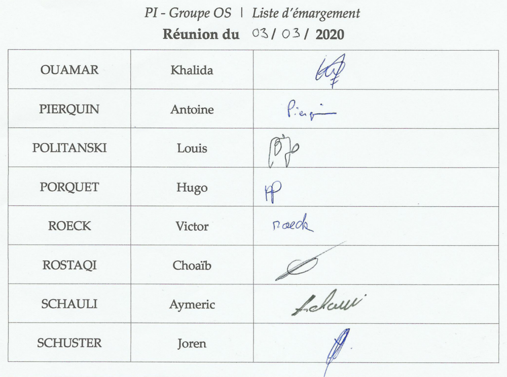

# PI - Groupe OS | Compte-rendu de réunion - 03/03/2020

- **Type  :**  Séance dédiée #06

- **Date  :**  Mardi 03 Mars 2020

- **Heure :**  13h30 -> 17h00 (3h30)

- **Lieu  :**  UFR, Salle T24

- **Membres présents :** Tout le monde

------------------------------------------------------

### [Note : Mini-réunion du 02/03]

Nous nous sommes **réunis sur Discord lundi 02 mars**, veille de cette séance, afin de **faire le point sur le projet** et sur les avancements réalisés pendant ces vacances.
Tout le monde était présent, à l'exception d'Aymeric qui n'était pas disponible à ce moment.

Au cours de cette réunion, qui a duré 45 minutes, nous avons récapitulé l'état actuel du projet, où nous en sommes, ce qui doit être fait en priorité. Tout cela a par ailleurs été ré-abordé au cours de la réunion "en présentiel" du 03 mars ; ces différents points sont donc décrits dans ce compte-rendu, en **section 1.1**.

Faire un compte-rendu uniquement pour cette réunion n'a pas été jugé pertinent par Joren, c'est pourquoi il est simplement fait mention de cette réunion dans ce compte-rendu-ci.

------------------------------------------------------

### [Ordre du jour - "Planning" de la réunion]

- **Faire le point**, ensemble, **sur les avancées pendant les 2 dernières semaines**, notamment celle de congés.

- **Récapituler l'état actuel du projet**, voir où on en est par rapport au diagramme de Gantt et modifier le planning prévisionnel au besoin

- **Plannifier le travail** à faire d'ici à la prochaine réunion (objectifs et points prioritaires)

- **Mettre au courant M. DECOR** de l'état du projet

- Continuer le travail, notamment **l'intégration noyau/IG** afin d'aboutir à une version permettant de faire une partie

------------------------------------------------------

## 1. Déroulement de la réunion

### 1.1. État actuel du projet et avancements (13h30)

- **Présentation de l'ordre du jour** à tous les membres (*cf.* section précédente)

- **Récapitulatif global de l'état actuel du projet**

    * Le noyau est quasiment fini, l'interface graphique est prête pour qu'une partie puisse être jouée

    * L'intégration noyau/IG a débuté mais est toujours en cours

    * La version pré-alpha n'est pas prête et est repoussée à la semaine prochaine

- **Récapitulatif de l'état actuel des différents modules**

    * **Noyau** : Globalement fini et fonctionnel, reste à le débugger

    * **Réseau** : Bien avancé, quelques modifications sont prévues, certaines fonctionnalités sont en attente avant que le noyau ne soit complétement fini. L'intégration est encore à réaliser, le chat vocal reste envisageable pour le moment mais ne sera pas abordé dans l'immédiat.

    * **IG** : Menus et écrans permettant une partie de jeu "basique" prêts

    * **BDD** : Beaucoup de requêtes réalisées (en SQLite) permettant notamment de faire des ajouts dans la BDD, de réaliser des traitements dessus... Des tests ont également été réalisés.

    * **IA** : Début des réflexions

- **Explication de Joren vis-à-vis de sa situation** : problèmes personnels depuis le début des vacances ; il n'a pas pu assurer un bon suivi du travail réalisé dernièrement mais va faire de son mieux pour rattraper ce qui a été fait.
Tous les membres de l'équipe sont désormais au courant.

- **Observation de notre situation par rapport au diagramme de Gantt initial** 

    * Le diagramme initial (du 03 février) prévoyait la réalisation de la pré-alpha pour ce jour. Cette version n'est pas encore disponible et sa sortie a été repoussée à la semaine suivante.

    * À l'heure actuelle, cependant, le noyau est quasiment fini, l'interface graphique prête pour une partie, le réseau bien avancé. Nous avons aussi de l'avance sur le planning en BDD grâce au travail d'Antoine.

    * Le diagramme de Gantt va être mis à jour afin de prendre en compte les modifications qui ont eu lieu par rapport à la version initiale, réalisée début février. Une section dédiée sera mise en place dans le wiki du *git*.

---------------------------

### 1.2. Planification : priorités et objectifs (\~ 14h00)

- L'**objectif fixé** est de **disposer la semaine prochaine d'un jeu "minimal" fonctionnel** et jouable (la version pré-alpha).

- Si une telle version n'est pas prête à ce moment, une **concertation suivie de décisions de modifications/réorganisation du planning et/ou d'équipes** seront à prévoir à la prochaine réunion.

- En fonction de la situation lors de la prochaine réunion, nous discuterons de la **stratégie et de la planification** pour les semaines suivantes.

---------------------------

### 1.3. Discussions sur des points généraux (entre nous puis avec M. DECOR) (\~ 14h10)

- ***GoogleSheets* pour remplir les heures**

    * Une amélioration a été apportée : il n'est plus nécessaire de colorier soi-même chaque case : la coloration se fait automatiquement en fonction de la catégorie, indiquée entre crochets au début de la description du travail (*ex: "[noyau] tests"*). De plus, cela permet de visualiser la catégorie *via* la couleur et le texte.

    * Personne n'ayant encore "rempli" ses heures jusqu'à présent, il a été décidé que nous remplirons nos heures d'ici à la semaine prochaine (i.e. les 7 premières semaines du projet)
    En effet, si nous prenons trop de retard sur ce point-ci, la complétion des heures va devenir davantage problématique chaque semaine.

- **Demande** par Joren **si certains membres ont d'éventuelles questions**, remarques concernant l'organisation des équipes, le développement, le planning...

    * **Aucune remarque particulière** (à part le rappel par Joren de sa situation)

    * **L'organisation actuelle convient aux membres**

- **Récapitulatif de la situation actuelle** auprès de notre tuteur, **M. DECOR**, par Joren

    * **Concernant le développement** : Bilan de l'état du projet (noyau quasiment prêt, "intégration" noyau/IG en cours, version pré-alpha repoussée à la semaine prochaine)

    * **Concernant l'organisation de l'équipe** : Les équipes sont bien organisées et aucune remarque ou demande de réorganisation n'a été faite par les membres

    * **Concernant des membres en particulier** : Explication de la situation de Joren depuis le début des congés universitaires afin que M. DECOR soit lui-aussi au courant

    * **Concernant les heures de travail** : Changements apportés au *GoogleSheets*, complétion prévue d'ici à la prochaine réunion

---------------------------

### 1.4. Travail sur le projet (\~ 14h30)

Nous avons ensuite continué à **travailler sur le projet**.

- Victor, Louis et Choaïb ont poursuivi le **travail d'intégration entre noyau et interface graphique** afin qu'une partie soit possible

- Aymeric et Hugo ont avancé sur **différents éléments de la partie graphique**, notamment l'affichage des ressources d'un joueur

- Khalida a continué à développer la **partie réseau**

- Antoine a poursuivi le **travail sur la BDD**

- Joren a pu **discuter** avec Antoine (BDD), Khalida (réseau), Victor (IG) et Choaïb (noyau) pour faire le point, globalement, sur les avancées récentes ainsi que ce qui est prévu. Certains points ont ainsi pu être discutés, expliqués, mis au point. 
Il a aussi abordé la question des **travaux qu'il pourrait faire** en plus de ceux liés à son rôle de chef de projet, étant donné qu'il a peu apporté au développement jusqu'à présent ; cependant les équipes sont bien organisées et les membres ne demandent pas de réorganisation des équipes ni de personne supplémentaire dans aucune équipe, pour le moment. Plusieurs tâches ont toutefois été proposées à Joren (*cf. fin de la section 3.1.*).

------------------------------------------------------

## 2. Bilan

### 2.1. Ce qui a été fait, les décisions prises : où nous en sommes

Nous avons pu **faire le point** sur l'état du projet, plannifier les priorités actuelles, discuter de points généraux, récapituler la situation à M. DECOR et avancer sur le projet.

---------------------------

### 2.2. Difficultés rencontrées

**Pas de difficulté en particulier lors de cette séance**, mis à part la situation personnelle de Joren qui a impacté son suivi et son travail depuis le début des congés comme expliqué en section 1.1.

------------------------------------------------------

## 3. À venir : ce qui est prévu

### 3.1. Dans les prochains jours

- **Pour tout le monde** : **compléter le GoogleSheets jusqu'à début mars**, au moins, afin de ne pas prendre trop de retard sur ce travail.

- **Pour chacun d'entre nous** :

    * équipes noyau et IG (Choaïb, Louis, Aymeric, Hugo, Victor) : poursuite de l'intégration noyau/IG afin d'aboutir à un jeu "minimal" fonctionnel (version pré-alpha)

    * Khalida : poursuite du réseau

    * Antoine : poursuite de la BDD, éventuellement de l'IA

    * Joren : "rattrapage" autant que possible du suivi des modules, recherche des assets restants, réflexions sur la modélisation des cartes de joueurs (affichage des ressources) et des sessions d'échange, mise à jour du diagramme de Gantt prévisionnel en fonction de la situation

- ***Note :*** L'implémentation actuelle différant de l'UML envisagé lors de la réalisation du cahier des charges, **il est prévu de refaire l'UML, conformément à l'implémentation réalisée**, afin que ces documents "à jour" soient disponibles pour les documents finaux (rapport final et/ou documentation développeur).

---------------------------

### 3.2. À la prochaine réunion (séance 07, mardi 10 mars 2020)

- **Récapituler le projet (état, avancées...) et la situation**. L'objectif est de disposer d'une version "pré-alpha", jouable.
Si une telle version n'est pas réalisée à ce moment, une concertation suivie de décisions de modifications/réorganisation du planning et/ou des équipes sont à prévoir.

- Discuter de la **stratégie pour les semaines à venir** et **plannifier les prochaines étapes**, en fonction de la situation.

- *Si possible et pertinent, revenir sur certains points abordés au cours d'anciennes discussions : réalisation du plateau 'moitié/moitié' (une partie à la main, le reste généré aléatoirement), possibilité de reconnexion lors d'une partie en ligne, chat vocal...*

------------------------------------------------------

## [Annexe - Liste d'émargement de la réunion]

{width=100% height=100%}
<!-- syntaxe spéficique Pandoc -->

