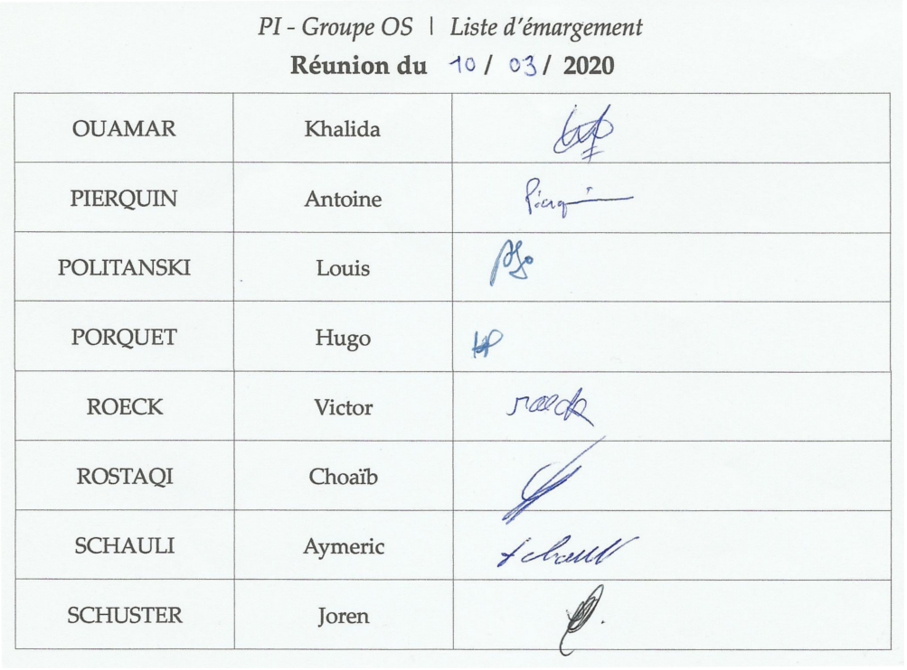
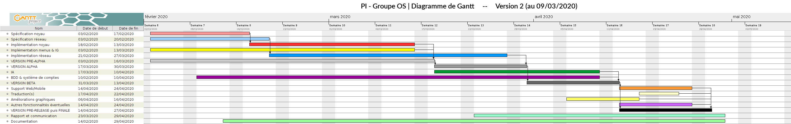

# PI - Groupe OS | Compte-rendu de réunion - 10/03/2020

- **Type  :**  Séance dédiée #07

- **Date  :**  Mardi 10 Mars 2020

- **Heure :**  13h30 -> 16h30 (3h)

- **Lieu  :**  UFR, Salle T24

- **Membres présents :** Tout le monde

------------------------------------------------------

### [Ordre du jour - "Planning" de la réunion]

- **Faire le point sur les avancées** depuis la dernière réunion.

- **Discuter du nouveau diagramme de Gantt** : organisation et état actuel du projet, prévisions et planification du travail

- Revenir sur les **heures de travail** à remplir

- **Faire un récapitulatif à M. DECOR** de l'état du projet

- Continuer le **travail de développement**.

------------------------------------------------------

## 1. Déroulement de la réunion

### 1.1. État actuel du projet, avancements et diagramme de Gantt (13h30)

- **Présentation de l'ordre du jour** à tous les membres (*cf.* section précédente)

- **Récapitulatif de l'état actuel du projet**

    * L'intégration noyau/IG a débuté est toujours en cours

    * Le réseau est en très bonne voie

    * La version pré-alpha est prévue pour la semaine prochaine (*cf.* paragraphe concernant le diagramme de Gantt)

- **Avancées depuis la dernière réunion** : peu d'avancées, globalement

    * **Noyau / IG** : principalement quelques résolutions de bugs, avancement dans le début de partie

    * **Réseau** : Début de l'intégration avec les fonctions du noyau (côté serveur), quelques modifications dans l'architecture

- **Diagramme de Gantt** 

    * Le **diagramme de Gantt** a été **mis à jour** par Joren : il prend en compte les modifications et changement de planning qui ont eu lieu depuis la version initiale (réalisée début février).

    * Ce diagramme apparaît à la fin du présent compte-rendu, en **annexe**.
    Il est aussi disponible sur notre **Git** : un **répertoire dédié**, qui regroupe les diagrammes de Gantt successifs mis à jour au fur et à mesure du semestre, a été mis en place (section `wiki/planning-gantt`).

    * La nouvelle version du planning est faite de manière à ce qu'il puisse être "**tenable**", et possède donc des dates de rendus des versions plus tardives que dans sa version initiale (il serait en effet contre-productif de faire un diagramme qui serait déjà obsolète dans une semaine).

    * Nous avons discuté ensemble de ce diagramme, afin de faire le point sur la nouvelle planification, ce qui change par rapport au diagramme dans sa version précédente, les dates prévues de livraison des différentes versions, les périodes où il y aura davantage de travail et celles où nous devrions avoir un peu de marge.

    * Le nouveau diagramme de Gantt est **validé et jugé "tenable"** par les membres ; nous allons faire en sorte de nous y tenir.

- **Suite du projet** : livraison d'une pre-alpha pour la semaine prochaine.

---------------------------

### 1.2. Discussions diverses (\~ 14h00)

- **Récapitulatif global de la situations à M. DECOR**

    * État du projet et avancements

    * Mise à jour du diagramme de Gantt et nouvelle planification

- **Complétion des heures**

    * Le GoogleSheets est prêt : il nous faut absolument remplir les heures cette semaine
**
    * Joren remplira les heures de tout le monde en ce qui concerne les réunions (séances, discords...) mais il appartient à chaque membre de remplir ses heures de travail personnel

    * **Cette complétion doit être faite d'ici à la prochaine réunion**

- **Demande** par Joren **si certains membres ont d'éventuelles questions** ou remarques sur n'importe quel aspect du projet.

    * Pas de problème entre les membres, le nouveau diagramme de Gantt est validé et les prochains jalons ont été convenus ensemble

    * **Aucune autre remarque particulière**

---------------------------

### 1.3. Travail sur le projet (\~ 14h15)

Nous avons ensuite continué à **travailler sur le projet**.

- Choaïb, Louis et Victor ont poursuivi le **travail d'intégration entre noyau et interface graphique**, notamment au niveau du début de partie (avancement et résolution de problèmes)

- Antoine et Khalida ont pu discuter des modules sur les lesquels ils travaillent respectivement (**BDD et réseau**), afin de convenir des choix à faire et de voir ce qu'il faut ajouter

- Aymeric, Hugo et Joren ont avancé sur **différents éléments de la partie graphique** : affichage des ressources d'un joueur, assets...
Joren a aussi pu discuter de certains points avec les membres et a nouveau abordé la question des **travaux qu'il pourrait faire** en plus de ceux liés à son rôle de chef de projet, étant donné qu'il a peu apporté au développement jusqu'à présent (comme lors de la dernière séance cependant, les membres ne demandent pas de réorganisation des équipes ni de personne supplémentaire, pour le moment).

Par ailleurs, nous avons appris qu'un autre groupe de PI rencontrait des difficultés : leur réseau est réalisé avec Photon (Photon Unity Networking), qui est un moteur réseau facilitant cet aspect du développement, et leur tuteur s'oppose à son utilisation.

Bien que nous n'utilisions pas un tel outil, **Antoine et Khalida ont préféré s'assurer que leur travail, bien avancé, ne risquait pas d'être remis en question voire invalidé**, alors que jusqu'à présent notre tuteur n'avait émis aucune remarque à ce sujet, que ce soit lors de la validation du CDC ou après lecture des différents CR de réunions.
Ils ont donc récapitulé avec Joren les différents aspects de leurs modules (**BDD et réseau**) afin qu'il puisse envoyer un message au tuteur pour avoir son avis sur la situation.

[11/03/2020 : Envoi d'un message par Joren à M. DECOR sur le Discord]

[12/03/2020 : Réponse de notre tuteur : il n'y a **pas de problème pour nous sur cet aspect du projet**, nous pouvons continuer sur notre lancée.]

------------------------------------------------------

## 2. Bilan

### 2.1. Ce qui a été fait, les décisions prises : où nous en sommes

Nous avons pu faire le point sur l'état du projet, discuter du nouveau diagramme de Gantt et le valider, plannifier les prochaines échéances, discuter de points généraux et récapituler la situation à M. DECOR. Nous avons ensuite avancé sur le projet.

---------------------------

### 2.2. Difficultés rencontrées

- **Pas de difficulté en particulier lors de cette séance**.

- Quelques doutes sont apparus concernant le réseau et la BDD (vis-à-vis de la situation que connaît un autre groupe en PI).
[12/03/2020 : la réponse de M. DECOR a cependant levé ces inquiétudes]

------------------------------------------------------

## 3. À venir : ce qui est prévu

### 3.1. Dans les prochains jours, pour chacun d'entre nous

- **Pour tout le monde** : **compléter le GoogleSheets**

- **Pour chacun d'entre nous** :

    * équipes noyau et IG (Choaïb, Louis, Aymeric, Hugo, Victor) : poursuite de l'intégration noyau/IG afin d'aboutir à un jeu "minimal" fonctionnel (version pré-alpha)

    * Khalida : suite du travail sur le réseau

    * Antoine : suite du travail sur la BDD, éventuellement de l'IA

    * Joren : suivi des modules, travail avec l'équipe IG sur la modélisation des cartes de joueurs et l'affichage des ressources, travail sur les sessions d'échanges, réflexions générales sur l'organisation des prochaines semaines

---------------------------

### 3.2. À la prochaine réunion (séance 08, 17 mars 2020)

- **Récapituler le projet (état, avancées...) et la situation**. L'objectif est de disposer d'une version "pré-alpha", permettant de faire une partie jouable en solo.

- **Faire le point** sur les prochaines étapes du projet et les priorités.

- Revenir sur des **points importants éventuellement repérés ou envisagés** au cours de la semaine, qu'ils concernent le planning, le développement, l'organisation...

------------------------------------------------------

## A. [Annexes]

### A.1. [Liste d'émargement de la réunion]

{width=100% height=100%}

---------------------------

### A.2. [Diagramme de Gantt - Version 2 du 09 mars 2020]

{width=100% height=100%}
