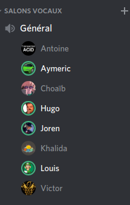

# PI - Groupe OS | Compte-rendu de réunion - 17/03/2020

- **Type  :**  Réunion hors-séance, à distance (vocal sur Discord)

- **Date  :**  Mardi 17 Mars 2020

- **Heure :**  14h00 -> 15h00 (1h)

- **Lieu  :**  *(chacun chez soi)*

- **Membres présents :** Tout le monde

------------------------------------------------------

### [Ordre du jour - "Planning" de la réunion]

- **Récapituler le projet (état, avancées...) et la situation**

- **Faire le point** sur les prochaines étapes du projet et les priorités

- Revenir sur des **points importants éventuellement repérés ou envisagés** au cours de la semaine, qu'ils concernent le planning, le développement, l'organisation...

- Discuter des **éventuels changements dans l'organisation si la situation a évolué depuis la dernière réunion** (que ce soit globalement ou pour l'un des membres de l'équipe en particulier)

------------------------------------------------------

## 1. Déroulement de la réunion

### 1.1. État actuel du projet

- La dernière réunion ayant eu lieu il y a seulement **deux jours** et de **nouvelles mesures de confinement** ayant été mises en place en France en raison de la situation actuelle, nous avons **peu travaillé** sur le projet depuis lors.

- Il y a donc eu **peu d'avancements globalement depuis la dernière réunion**. Toutefois : 

    * [BDD] De **gros avancements sur la BDD** ont été réalisés par Antoine. Celle-ci est désormais **quasi finie**

    * [Réseau] Khalida a fait des **tentatives de sérialisation** mais n'a pas pu beaucoup avancer

    * [Noyau] Louis a pu continuer de **corriger des bugs**, notamment en ce qui concerne la distribution des ressources

- Par ailleurs, en dehors des mesures de confinement, la situation n'a pas vraiment évolué depuis la dernière réunion. **Notre organisation** (travail/communication via Discord et réunions deux fois par semaine) **reste donc la même pour le moment**.
En outre, **aucun membre de l'équipe** n'a fait part de **problème particulier**.

---------------------------

### 1.2. Plannification pour les prochains jours

- Nous avons **fait le point sur la répartition des tâches** de tous les membres.
    
    * Du fait qu'il y ai eu peu d'avancement depuis la dernière réunion, **les attributions et objectifs restent globalement les mêmes**.

    * Cela a toutefois été l'occasion de **re-préciser tout ces points** et d'**affecter des tâches à Aymeric**, qui n'avait pu être présent à la dernière réunion.

    * Les attributions sont **décrites en section 3.1. de ce CR**

- Enfin, nous avions prévu, lors de nos récentes discussions, d'organiser deux réunions par semaine. Nous avons ainsi convenu que **la prochaine réunion aurait lieu vendredi 20 ou samedi 21 mars**. La date exacte sera fixée prochainement via Discord, en fonction des disponibilités de chacun.

------------------------------------------------------

## 2. Bilan

### 2.1. Ce qui a été fait, les décisions prises : où nous en sommes

Cette courte réunion nous a permis de **faire le point sur le projet** et de **rappeller les différentes tâches** sur lesquelles il nous faut travailler pendant les jours à venir.

La dernière réunion ayant eu lieu il y a peu de temps et de nouvelles mesures dûes à la situation actuelle ayant été mises en place, il n'y a eu que **peu d'avancées** depuis ; c'est d'ailleurs pourquoi cette **réunion** a été **particulièrement courte**.

Nous gardons ainsi "le **même cap**" **d'ici à la prochaine réunion**.
Celle-ci aura lieu en fin de semaine, vendredi ou samedi.

---------------------------

### 2.2. Difficultés rencontrées

**Pas de difficulté particulière** pour cette réunion.

Nous faisons en sorte de garder contact de manière régulière via Discord et restons organisés jusqu'à présent.

------------------------------------------------------

## 3. À venir : ce qui est prévu

### 3.1. Dans les prochains jours, pour chacun d'entre nous

- *Le projet ayant peu avancé depuis la réunion du 15 mars (en dehors de la BDD), les tâches restent globalement les mêmes pour les jours à venir.*

- **Pour tout le monde** : continuer de **compléter les heures**

- **Pour chacun d'entre nous** :

    * Victor continue l'intégration IG/noyau pour qu'une partie soit fonctionnelle, et signale les problèmes ou éléments manquants à l'équipe noyau

    * Choaïb et Louis font des corrections au noyau (selon les fonctions desquelles ils se sont occupés lors du développement), ils vont aussi pouvoir s'occuper de la documentation du noyau (celui-ci n'étant, à priori, que peu amené à changer désormais). La réalisation d'un fichier de tests du noyau est également prévue.

    * Khalida : suite du travail sur le réseau (sérialisation des interfaces et réflexions sur le chat vocal)

    * Antoine : travail sur l'IA

    * Aymeric et Hugo : travail sur la partie graphique (menu d'échanges et système de défausse)

    * Joren : travail sur plusieurs aspects du projet avec différents membres

        - affichage des ressources (cartes de joueurs), avec Victor

        - modélisation et affichage du menu d'échanges et du système de défausse, avec Aymeric et Hugo

        - réflexions sur l'IA, avec Antoine

---------------------------

### 3.2. À la prochaine réunion (vendredi 20 ou samedi 21 mars)

- **Récapituler le projet (état, avancées...) et la situation**

- **Faire le point** sur les prochaines étapes du projet et les priorités.

- Discuter des **éventuels changements dans l'organisation si la situation évolue** (que ce soit globalement ou pour l'un des membres de l'équipe en particulier)

------------------------------------------------------

## [Annexe - Liste d'émargement de la réunion]

Étant donné que pour les prochains temps, les réunions se dérouleront exclusivement via Discord, il nous sera impossible de faire passer une liste d'émargement comme d'ordinaire.

Ainsi, pour le moment et dans l'attente d'une éventuelle et meilleure autre solution, cette liste est remplacée par une capture d'écran du salon Discord auquel nous nous connectons en vocal.

{width=30% height=30%}
<!-- syntaxe spéficique Pandoc -->
