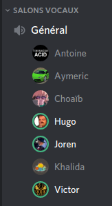

# PI - Groupe OS | Compte-rendu de réunion - 21/03/2020

- **Type  :**  Réunion hors-séance, à distance (vocal sur Discord)

- **Date  :**  Samedi 21 Mars 2020

- **Heure :**  15h10 -> 16h20 (1h10)

- **Lieu  :**  *(chacun chez soi)*

- **Membres présents :** Tout le monde, à l'exception de Louis (qui était fiévreux)

------------------------------------------------------

### [Ordre du jour - "Planning" de la réunion]

- **Récapituler le projet (état, avancées...) et la situation**

- **Faire le point** sur les prochaines étapes du projet et les priorités.

- Discuter des **éventuels changements dans l'organisation si la situation a évolué** (que ce soit globalement ou pour l'un des membres de l'équipe en particulier)

------------------------------------------------------

## 1. Déroulement de la réunion

### 1.1. Récapitulatif et état actuel du projet (15h10)

- Nous avons commencé par faire le **tour du travail de chaque membre depuis la dernière réunion**, qui a lieu mardi 17 mars

    * Khalida a continué le travail sur le réseau :

        - sérialisation et tests faits

        - gestion des évènements, envoi/réception fonctionnels

        - intégration noyau/serveur préparée ; intégration avec le BDD aussi mais quelques aspects restent à régler

        - début de recherches sur l'éventuel chat vocal : pour le moment, deux possibilités semblent être disponibles (soit via des assets payants, soit via l'encapsulation des messages des joueurs dans des fichiers .mp3 - ce qui risque d'être lourd)

    * Choaïb a réalisé plusieurs *fixs* sur le noyau et s'est occupé de la documentation de ce module

    * Victor a poursuivi l'intégration afin de pouvoir réaliser une partie complète, pour laquelle il ne manque plus que quelques éléments

    * Aymeric, Hugo et Joren ont travaillé sur l'interface graphique, en réalisant la conception, la modélisation et les assets des systèmes (1) d'affichage des informations des joueurs, (2) de défausse (lorsque le brigand est "actif") et (3) d'échange entre joueurs/commerce.

- Concernant les **travaux (1), (2) et (3)** mentionnés dans le dernier paragraphe ci-dessus : 

    * Ces différentes tâches ont été réalisées entre les membres concernés au cours de plusieurs réunions ces derniers jours.

    * Étant donné que ces systèmes (1), (2) et (3) concernent des éléments importants du jeu, qui sont au "coeur" de toute partie, ils ont été **présentés en détail au cours de cette réunion** afin que chaque membre puisse donner son avis dessus, ses remarques et éventuellement ses idées d'améliorations.

    * Pour chaque système, une **présentation des schémas de conception** a été faite (ces derniers sont disponibles sur notre Git, dans le répertoire `wiki/conception`), **puis** les **assets et éléments graphiques** réalisés à partir de ces ébauches ont été montrés

        - **(1) Affichage des informations des joueurs**
        [Modélisation et affichage graphique validés.]
        Il reste cependant du travail sur plusieurs aspects :

            * différenciation des éléments "chevalier le plus puissant" et "route la plus longue" des autres assets pour que l'affichage soit plus clair

            * différenciation du bouton "affichage des cartes développement" : il faut que l'on comprenne facilement que c'est un bouton ayant une action directe sur l'affichage

            * implémentation et mise en forme des assets des cartes développement jouables (les 5 en bas, dans le schéma de conception), mise en place d'un fonctionnement pertinent pour les afficher

        - **(2) Défausse**
        [Modélisation et affichage graphique validés.]
        Un peu de travail est encore nécessaire pour ce système :

            * séparation plus nette de la "zone du milieu" sur l'affichage, permettant d'afficher l'état actuel de la défausse

            * différenciation du fonctionnement en local / en réseau (en local, chaque joueur devant défausser le fait chacun son tour ; en réseau, chaque joueur a une "unique" défausse pour lui)

        - **(3) Échange entre joueurs et commerce**
        [Modélisation et affichage graphique validés.]
        Il faudra toutefois rediscuter ensemble de certains points au niveau des échanges :

            * démarrage de la session (par n'importe qui ? à quel moment ? par quel moyen ? nécessité de demander l'"acceptation" du joueur dont c'est le tour pour que la session puisse démarrer ?)

            * système de confirmation (au niveau conceptuel, technique et d'implémentation)

            * fermeture/arrêt de la session (choix possible pour la personne qui a lancé la session ? pour la personne dont c'est le tour actuellement ?)

    * Ces trois systèmes importants du jeu ont ainsi pu être discuté ensemble, et le travail réalisé à leur niveau a été validé par les membres présents. Il reste toutefois certains points à améliorer.
    Les éventuelles remarques ou idées de Louis seront prises en compte dès que nous aurons l'occasion d'en parler avec lui.

- Nous avons ainsi pu **récapituler l'état actuel du projet, dans ses différents aspects** :

    * **[Projet global]** L'intégration est quasiment finie, la pré-alpha sera disponible pour de bon la semaine prochaine, normalement.

    * **[Noyau]** Fini, des corrections sont encore en cours, une grosse majorité de la documentation a été réalisée.

    * **[Réseau]** La version du jeu qui devrait voir le jour la semaine prochaine ne contiendra aucun élément propre au réseau, mais ce module est dans les temps au regard du diagramme de Gantt actuel.

    * **[BDD]** Ce module est très bien avancé dans sa réalisation. Il est lui aussi à un bon stade par rapport à notre diagramme de Gantt.  

    * **[IA]** Antoine a déjà avancé la réflexion sur ce module, le travail sera poursuivi la semaine prochaine et devrait devenir un des points importants du développement au cours du mois d'avril.

---------------------------

### 1.2. Plannification et tâches pour les prochains jours (\~ 16h00)

- Nous avons ensuite plannifié les prochains jours :
    
    * Les **tâches et leur répartition** ont été définies

    * L'objectif d'un **jeu jouable** pour la **semaine prochaine** a été clairement posé

    * Les décisions sont **décrites en section 3.1. de ce CR**

- Enfin, nous nous sommes mis d'accord sur la **date de la prochaine réunion de groupe** : **mardi 24 mars en début d'après-midi** (probablement vers 14h00 - mais nous définirons un horaire plus précis sur Discord d'ici là).

------------------------------------------------------

## 2. Bilan

### 2.1. Ce qui a été fait, les décisions prises : où nous en sommes

Nous avons pu **faire le point sur les avancées de ces derniers jours** et sur **l'état global du projet**. Chacun a pu faire un récapitulatif clair de son travail et les discussions, qu'elles concernent les avancées en IG (informations des joueurs, défausse, échanges) ou le projet en général, ont été productives.

Les **tâches de chacun ont été attribuées** et les **priorités revues** de manière à ce qu'une première version du jeu puisse être présentée la semaine prochaine.

---------------------------

### 2.2. Difficultés rencontrées

**Pas de difficulté particulière** pour cette réunion.

Louis n'a cependant pas pu être présent à la réunion du fait qu'il était fiévreux.
Tous les membres lui souhaitent un bon rétablissement et espèrent qu'il ira mieux rapidement.

------------------------------------------------------

## 3. À venir : ce qui est prévu

### 3.1. Dans les prochains jours, pour chacun d'entre nous

- **Pour tout le monde** : **compléter les heures** jusqu'à mi-mars dans l'idéal. Joren remplira par ailleurs les heures de travail liées aux réunions pour l'ensemble des membres.

- **Pour chacun d'entre nous** :

    * Victor : suite du travail visant à obtenir une première version du jeu (c'est la priorité). Il sera pour ce faire épaulé par Choaïb, Khalida et Antoine au besoin.

    * Khalida : aide pour les problèmes liés au noyau et l'intégration avec Victor, en fonction des besoins, quitte à laisser le réseau en *standby* pendant quelques jours

    * Choaïb : reste sur le noyau et aide pour l'intégration, avec Victor

    * Antoine : continuation de l'IA et aide sur l'intégration éventuellement, en fonction du temps libre et des disponibilités

    * Aymeric : aide sur les travaux liés à l'IG, en fonction du temps libre et des disponibilités

    * Hugo : avec Joren, re-travail et améliorations sur l'affichage des informations des joueurs, le système de défausse, les échanges entre joueurs et le commerce (*cf* deuxième point de la section 1.1 de ce CR)

    * Joren : amélioration de la documentaion (prise en compte dans le `.gitignore` pour ne pas conserver les documents de documentation générés, choix des formats pertinents, amélioration du `Doxyfile`).
    Contact avec Louis pour prendre de ses nouvelles.

    * *Louis ne va, à priori, pas travailler ces prochains jours. Aucune tâche ne lui a donc été affectée, c'est d'ailleurs pourquoi quelques réorganisations ont eu lieu dans l'équipe pour que le travail puisse se poursuivre.*

---------------------------

### 3.2. À la prochaine réunion (mardi 24 mars)

- **Récapituler le travail et les avancements** fait par chacun des membres

- **Faire le point** sur **l'état actuel du projet** ainsi que les **prochaines étapes du projet**, définir les **priorités**. Produire un **nouveau diagramme de Gantt** au besoin. 

- **Organiser les équipes** et **attribuer les tâches de chacun** en fonction de tout ces aspects.

- **Rediscuter ensemble de certains points** :

    * affichage des informations des joueurs, système de défausse, échanges entre joueurs (*cf* deuxième point de la section 1.1 de ce CR)

    * commerce (tous les cas sont-ils gérés ? échange de 4 ressources contre une ressource, ports...)

    * spécificités et différenciation jeu local / jeu en ligne (notamment pour l'affichage des informations des joueurs, la défausse et les échanges/commerce)

    * IA

- Si le cas se présente, discuter des **éventuels changements dans l'organisation du projet (globalement) si la situation actuelle dûe à l'épidémie évolue**, que ce soit globalement ou pour l'un des membres de l'équipe en particulier

------------------------------------------------------

## [Annexe - Capture d'écran du salon vocal de la réunion sur Discord]

{width=35% height=35%}
<!-- syntaxe spéficique Pandoc -->
