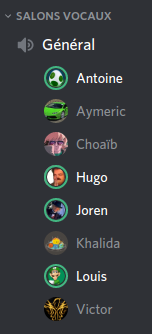

# PI - Groupe OS | Compte-rendu de réunion - 24/03/2020

- **Type  :**  Réunion hors-séance, à distance (vocal sur Discord)

- **Date  :**  Mardi 24 Mars 2020

- **Heure :**  14h50 -> 15h50 (1h00)

- **Lieu  :**  *(chacun chez soi)*

- **Membres présents :** Tout le monde

------------------------------------------------------

### [Ordre du jour - "Planning" de la réunion]

- **Récapituler le travail et les avancements** fait par chacun des membres

- **Faire le point** sur **l'état actuel du projet** ainsi que les **prochaines étapes du projet**, définir les **priorités**. Prévoir la réalisation d'un **nouveau diagramme de Gantt** au besoin. 

- **Organiser les équipes** et **attribuer les tâches de chacun** en fonction de tout ces aspects.

- **Rediscuter ensemble de certains points** :

    * affichage des informations des joueurs, système de défausse, échanges entre joueurs (*cf* deuxième point de la section 1.1 du CR de la précédente réunion, du 21 mars)

    * commerce (tous les cas sont-ils gérés ? échange de 4 ressources contre une ressource, ports...)

    * spécificités et différenciation jeu local / jeu en ligne (notamment pour l'affichage des informations des joueurs, la défausse et les échanges/commerce)

    * IA

    * Documentation (regroupement dans un dossier dédié, gestion des différents modules ; plusieurs docs distinctes ?)

- Si le cas se présente, discuter des **éventuels changements dans l'organisation du projet (globalement) si la situation actuelle dûe à l'épidémie évolue**, que ce soit globalement ou pour l'un des membres de l'équipe en particulier

------------------------------------------------------

## 1. Déroulement de la réunion

### 1.1. Récapitulatif et état actuel du projet

- Nous avons commencé par **récapituler le travail et les avancements** fait par chacun des membres depuis la denrière réunion

    * Khalida : suite du travail sur le réseau et de l'intégration avec la BDD

    * Victor : progrès dans le développement des éléments d'une partie de jeu et résolution de bugs plus ou moins importants en cours de partie qui "trainaient" depuis quelques temps

    * Choaïb : réalisations de plusieurs *fixs* sur le noyau (résolution de bugs)

    * Louis : Génération d'une version web du jeu actuel (sur une page web), pour tester
    *(Par ailleurs, Louis va mieux depuis la dernière réunion et il lui est possible de continuer le travail)*

    * Joren : réorganisation de la documentation, ajout des derniers assets manquants pour les cartes de développement jouables, mise à jour de la complétion des heures de travail liées aux réunions pour l'ensemble des membres

- Nous avons ensuite **fait le point** sur **l'état actuel du projet**

    * De bonnes avancées ont été faites, notamment en ce qui concerne l'affichage des informations des joueurs (même s'il reste encore des choses à afficher) et la gestion du voleur/brigand.

    * Il reste toutefois certains points à réaliser pour que tous les aspects du jeu soient implémentés (principalement la défausse lors de l'activation du voleur et les phases d'échange et de commerce)

    * Nous avons ainsi une **partie de jeu quasiment jouable dans son intégralité**

        - La pré-alpha n'est donc pas encore prête ; car nous avions défini la pré-alpha comme étant une version du jeu basique (sans réseau, ou autre) implémentant **toutes** les caractéristiques d'une partie.

        - La défausse et les échanges/commerce n'étant pas encore mis en place, nous ne considérons donc pas cette version comme étant réalisée.

        - Toutefois, nous disposons de quelque chose de jouable, certes encore buggé sur plusieurs points, mais bien avancé, comme le démontre le test de la version web actuelle.

        - Par ailleurs, les autres modules (réseau, BDD notamment) qui ne sont pas encore intégrés au jeu continuent tout de même d'être travaillés en vue de leur prochaine intégration.

    * Après discussion, un diagramme de Gantt actualisé verra probablement le jour la semaine prochaine en fonction des avancées qui seront faites d'ici là.

- Notre tuteur, **M. DECOR**, s'est ensuite connecté sur le salon vocal et **a rejoint notre réunion pendant quelques minutes**. Cela a été l'occasion de :

    * Récapituler avec lui où nous en sommes au niveau du développement du jeu

        - (*cf paragraphe précédent*)

        - M. DECOR a pu voir ce qu'il en était en lancant la version web "test" du jeu générée par Louis

    * Faire le point sur la situation actuelle "administrative" à l'Université : l'UFR sera vraisemblablement fermé pendant encore, au moins, tout le mois d'avril. Le projet intégrateur continue donc via Discord en ce qui concerne nos réunions.

    * Demander s'il disposait d'informations plus spécifiques en PI, notamment en ce qui concerne l'évaluation

        - Dans la configuration actuelle des choses, si l'UFR ré-ouvre aux environs du 04/05/2020, il n'y aurait pas de décalage des dates de rendu et soutenances. 

        - Autrement, on ne sait pas encore. Tout cela reste de toute manière à voir car personne n'a de réelle visibilité sur la situation pour le moment.

        - M. DECOR n'a pas eu davantage de nouvelles de M. CATELOIN.

    * Rappeler que quoiqu'il en soit, nous gardons contact via Discord (entre les membres et avec M. DECOR) pour toute demande, mise au point, récapitulatif ou nouvelle information importante.

---------------------------

### 1.2. Planification et tâches pour les prochains jours

- Après avoir fait le point, nous avons **attribué les tâches de chacun** en fonction des **prochaines étapes du projet** et des **priorités**. 

- Ces décisions sont **décrites en section 3.1. de ce CR**

---------------------------

### 1.3. Discussions autour de certains points du projet

- **Affichage des informations des joueurs** : plusieurs améliorations devront être faite au cours des prochains jours

    * différenciation des éléments "chevalier le plus puissant" et "route la plus longue" des autres assets pour que l'affichage soit plus clair

    * différenciation du bouton "affichage des cartes développement" : il faut que l'on comprenne facilement que c'est un bouton ayant une action directe sur l'affichage

    * mise en forme des assets des cartes de développement jouables (les 5 en bas, dans le schéma de conception)

- **Défausse** : nous pourrons modifier légèrement l'asset, en séparant davantage la "zone du milieu" sur l'affichage, permettant d'afficher l'état actuel de la défausse

- **Échange entre joueurs** : discussion et définition de plusieurs choix concernant le fonctionnement

    * démarrage de la session : démarrage automatique de la session d'échange, pour tout le monde, au moment venu pendant le tour (lorsque la phase d'échange commence)

    * système de confirmation

        - *cf* la description du schéma de conception (`conception-in-game-session-echange-joueurs.png` dans `wiki/conception`)

        - pour un point cependant nous pensons faire un changement : un joueur qui aura confirmé sa propre offre ne pourra pas la modifier, à moins qu'un autre joueur ne modifie la sienne 

    * fermeture/arrêt de la session : le joueur dont c'est le tour, et lui seul, peut mettre fin à la session d'échange n'importe quand (une confirmation lui sera tout de même demandée pour s'assurer que c'est bien là son souhait)

- **Commerce** : après réflexion, nous pensons que tous les cas sont gérés et que l'asset peut être laissé tel quel.

- **Spécificités et différenciation jeu local / jeu en ligne**

    * **Affichage des informations des joueurs**

        - en local : tout le monde voit tout

        - en ligne : chaque joueur voit ses propres ressources et cartes de développement, mais pas celles des autres

    * **Défausse (voleur / brigand)**

        - en local : il y a autant de successions d'écrans de défausse que de joueurs concernés

        - en ligne : vérification des clients concernés, envoi d'un évènement, écran de défausse puis validation par chacun des joueurs ; le serveur met ainsi à jour l'état du jeu et renvoie ce nouvel état à tous les joueurs

    * **Échanges**

        - en local : il faudra s'assurer que seules deux cases "confirmation" sont cochées (la case du joueur dont c'est le tour et une case chez un des joueurs dont ce n'est pas le tour). La session d'échange pourra être arrêtée à tout moment.

        - en ligne : 

            * tant que la session est en cours : ajout/retrait de ressources à l'offre de chaque joueur possible, évènements transmis au fur et à mesure à tous les joueurs

            * si deux confirmations ont lieu et que les évènements de réception de confirmation sont reçus : clôture de l'échange et modification du nombre de ressources des joueurs concernés

- **IA**

    * Antoine a déjà commencé à réfléchir et à implémenter certains éléments de base pour l'IA

    * Antoine, Louis et Joren discuteront des possibilités de réalisation de l'IA et des éléments du noyau qui seront utiles dans les prochains jours, en vocal (mercredi soir ou jeudi matin)

- **Documentation du code**

    * Discussion et explications des changements faits par Joren

        - Regroupement dans un dossier dédié (`doc/`) où apparait le `Doxyfile` et où seront générés les documentations des différents modules

        - Mise à jour du `.gitignore` pour que les fichiers de documentation générés (Latex, HTML...) ne figurent plus sur le Git (chaque personne ayant un dépôt de `pi` pourra ainsi générer sa doc en local, sans que celle-ci ne soit mise à jour sur le Git ou n'entre en conflit avec une documentation existante déjà récupérée)

    * Nous avons la possibilité de faire plusieurs documentations séparées (une pour le noyau, une pour le réseau...) ou une seule qui combine tous les modules : nous réfléchirons au choix le plus pertinent pour la maintenabilité de la documentation et sa lisibilité.

    * À priori, des commandes seront quoiqu'il arrive mises en place pour faciliter la génération de la documentation depuis `pi`

    * La documentation des autres modules est à venir. Concernant le noyau, certains fichiers source `.cs` ne sont pas encore documentés : ils le seront en fonction de leur intérêt et degré de complexité.

---------------------------

### 1.4. Discussions concernant la suite du projet 

- Nous avions prévu, comme à chaque réunion dernièrement, de discuter des **éventuels changements dans l'organisation du projet (globalement) si la situation actuelle dûe à l'épidémie évolue**, que ce soit globalement ou pour l'un des membres de l'équipe en particulier.
Ce cas ne s'est pas présenté depuis la dernière fois où nous nous sommes réunis.

- Enfin, nous avons convenu d'une **date pour la prochaine réunion** : samedi 28 mars dans l'après-midi, probablement vers 14h30 - 15h00.

------------------------------------------------------

## 2. Bilan

### 2.1. Ce qui a été fait, les décisions prises : où nous en sommes

Après avoir fait le **point sur les avancées des derniers jours** et **l'état actuel du projet**, **notamment avec M. DECOR**, nous avons pu **définir le travail à faire pour les prochains jours**.

Cette réunion a aussi été l'occasion de **discuter de plusieurs points** : affichage des informations des joueurs, défausse, échange entre joueurs, commerce, spécificités et différenciation jeu local / jeu en ligne, IA, documentation du code.

---------------------------

### 2.2. Difficultés rencontrées

**Pas de difficulté particulière** pour cette réunion.

------------------------------------------------------

## 3. À venir : ce qui est prévu

### 3.1. Dans les prochains jours, pour chacun d'entre nous

- Choaïb, Louis, Victor : suite du travail visant à obtenir une version complète du jeu 

- Khalida : suite du travail en réseau

- Aymeric, Hugo : réalisation des modifications à faire concernant certains assets de l'IG

- Antoine, Louis, Joren : discussions concernant l'IA

- Par ailleurs, étant donné qu'il y aura dorénavant peu de modifications sur le noyau et que la quasi-totalité de l'IG a été réalisée, **l'organisation et la constitution des différentes équipes vont vraisemblablement être revues lors de la prochaine réunion** pour prendre en compte les prochaines étapes du développement : réseau, BDD, IA, et évidemment la partie de jeu dans sa globalité.

---------------------------

### 3.2. À la prochaine réunion (samedi 28 mars)

- **Récapituler le travail et les avancements** fait par chacun des membres

- **Faire le point** sur **l'état actuel du projet** ainsi que les **prochaines étapes du projet**, définir les **priorités**. Produire un **nouveau diagramme de Gantt** au besoin (cette étape interviendra probablement la semaine suivante - semaine 14).

- **Organiser les équipes** et **attribuer les tâches de chacun** en fonction de tout ces aspects. Étant donné qu'il y aura dorénavant peu de modifications sur le noyau et que la quasi-totalité de l'IG a été réalisée, l'organisation et la constitution des différentes équipes seront vraisemblablement revues pour prendre en compte les prochaines étapes du développement : réseau, BDD, IA, et évidemment la partie de jeu dans sa globalité

- **Rediscuter ensemble de certains points** :

    * IG : améliorations des assets concernant l'affichage des infos des joueurs, la défausse, les sessions d'échanges (bilan du travail réalisé ou autres modifications à faire)

    * IA

    * Prochaines étapes importantes du projet (intégration réseau, intégration BDD, documentation et documents finaux à remettre)

- Si le cas se présente, discuter des **éventuels changements dans l'organisation du projet (globalement) si la situation actuelle dûe à l'épidémie évolue**, que ce soit globalement ou pour l'un des membres de l'équipe en particulier

------------------------------------------------------

## [Annexe - Capture d'écran du salon vocal de la réunion sur Discord]

{width=35% height=35%}
<!-- syntaxe spéficique Pandoc -->
