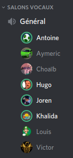

# PI - Groupe OS | Compte-rendu de réunion - 28/03/2020

- **Type  :**  Réunion hors-séance, à distance (vocal sur Discord)

- **Date  :**  Samedi 28 Mars 2020

- **Heure :**  15h10 -> 16h00 (50mn)

- **Lieu  :**  *(chacun chez soi)*

- **Membres présents :** Tout le monde

------------------------------------------------------

### [Ordre du jour - "Planning" de la réunion]

- **Récapituler le travail et les avancements** fait par chacun des membres

- **Faire le point** sur **l'état actuel du projet** ainsi que les **prochaines étapes du projet**, définir les **priorités**. Produire un **nouveau diagramme de Gantt** au besoin (cette étape interviendra probablement la semaine prochaine - semaine 14).

- **Organiser les équipes** et **attribuer les tâches de chacun** en fonction de tout ces aspects. Étant donné qu'il y aura dorénavant peu de modifications sur le noyau et que la quasi-totalité de l'IG a été réalisée, l'organisation et la constitution des différentes équipes vont être revues pour prendre en compte les prochaines étapes du développement : réseau, BDD, IA, et évidemment la partie de jeu dans sa globalité.

- **Rediscuter ensemble de certains points** :

    * IG : améliorations des assets concernant l'affichage des infos des joueurs, la défausse, les sessions d'échanges (bilan du travail réalisé ou autres modifications à faire)

    * IA

    * Prochaines étapes importantes du projet (intégration réseau, intégration BDD, documentation et documents finaux à remettre)

- Si le cas se présente, discuter des **éventuels changements dans l'organisation du projet (globalement) si la situation actuelle dûe à l'épidémie évolue**, que ce soit globalement ou pour l'un des membres de l'équipe en particulier

------------------------------------------------------

## 1. Déroulement de la réunion

### 1.1. Récapitulatif des avancements et de l'état du projet

- Comme à l'accoutumée, nous avons tout d'abord **récapitulé le travail et les avancements** fait par chacun

    * Aymeric : mise en forme de l'asset d'affichage des cartes de développement jouables et peaufinage de la fiche d'affichage des informations des joueurs

    * Choaïb : résolution de bugs sur le noyau

    
    * Louis : création d'une IA basique qui se contente de passer son tour et ne fait rien d'autre

    * Antoine : travail sur l'IA en se servant de l'ébauche de Louis pour apporter des améliorations dessus (mise en place d'un peu d'aléatoire avec un minimum de logique - "IA facile")

    * Antoine, Louis et Joren ont discuté des modalités et possibilités de l'IA jeudi matin, pendant 30mn

    * Khalida :

        - Tentative de mise en place d'un chat vocal : difficile via des fichiers `.mp3`, les résultats sont peu probants pour le moment.
        *Photon Unity Networking*, un moteur réseau, constituerait peut être une solution ; reste à voir si cela fonctionnerait et serait pertinent au regard du code réseau déjà développé. Nous y réfléchirons et en discuterons plus tard avec notre tuteur afin de voir si cette solution serait envisageable.

        - Début d'intégration avec le client/IG (notamment pour la phase d'entrée dans le lobby d'un serveur)

        - Réflexions quant au réaménagement de la structure des évènements dans le noyau pour la sérialisation

    * Victor : mise en place des échanges portuaires (commerce : échanges *4 ressources contre 1* pour le moment) et début d'implémentation des échanges entre joueurs ; ceux-ci sont relativement complexes mais de bons avancements ont été faits à ce niveau

- Nous avons ensuite **fait le point** sur **l'état actuel du projet**, en établissant pour chaque aspect du jeu **où nous en sommes** et **ce qu'il reste à faire**

    * Concernant le **jeu en lui-même**, nous nous rapprochons de plus en plus d'une partie de jeu jouable dans son intégralité

        - Au niveau des systèmes en cours de partie, il reste à mettre en place la défausse, à compléter le commerce et à continuer les sessions d'échanges (sur lesquelles il y a eu des avancées depuis la dernière réunion)

        - Concernant les fonctionnalités, la possibilité d'utiliser des cartes de développement n'est pas encore intégrée non plus mais cela ne devrait pas constituer une difficulté particulière

        - Reste enfin à gérer les fins de parties "proprement" (écran d'affichage avec possibilités de retour au menu, entre autres)

    * Concernant les **autres modules**, le travail est bien avancé

        - Réseau : reste principalement à gérer les évènement du côté client et à intégrer ce module avec les autres

        - BDD : la quasi-totalité est faite globalement, mis à part quelques correctifs qui seront à apporter, ou bugs à résoudre lors de l'intégration avec les autres modules

        - IA : des réflexions ont déjà eu lieu et le travail sur ce module va être un des axes de travail principaux pendant les semaines à venir

    * La production d'un **nouveau diagramme de Gantt** est envisagée la **semaine prochaine** (semaine 14) en fonction des dernières avancées qui auront encore lieu d'ici à la prochaine réunion.

---------------------------

### 1.2. Planification et organisation des équipes

- Nous avons ensuite défini les **prochaines étapes du projet**, et par la même occasion **réorganisé les équipes** et **attribué les tâches de chacun des membres**

    * Étant donné qu'il y aura dorénavant peu de modifications sur le noyau et que la quasi-totalité de l'IG a été réalisée, il a été jugé pertinent de procéder à une réorganisation des équipes pour prendre en compte les prochaines étapes du développement : réseau, BDD, IA, et évidemment la partie de jeu dans sa globalité.

    * Nous nous sommes donc tous mis d'accord sur une **nouvelle constitution des équipes**. Celle-ci est décrite dans le tableau ci-dessous, qui reprend la structure de celui figurant dans notre cahier des charges, et décrivait la répartition initiale des membres (*cf* page 18 dudit document) :

    | **Module**      | **Responsable du module** | **Autre(s) membre(s)**  |
    |--------------------|------------------------|-------------------------|
    | Réseau             | Khalida | Louis                                  |
    | IA                 | Antoine | Choaïb , Hugo**°**                     |
    | Déroulement partie | Victor  | Aymeric , Hugo**°** , Choaïb**\*** , Louis**\***   |

- Joren a proposé une organisation en **trois équipes principales**, après quoi nous avons discuté ensemble des possibilités de répartition.
La **répartition sur laquelle nous nous sommes mis d'accord** prend en compte le travail déjà effectué par les membres sur les différents modules ainsi que leurs préférences quant aux tâches de développement à faire. Ainsi :

    * Khalida, qui a assuré le développement du réseau jusqu'à présent, continue à travailler sur ce module. Elle est désormais rejointe par Louis.

    * Antoine poursuit le travail qu'il a déjà entamé au niveau de l'IA. Choaïb va également participer au développement de ce module.

    * Le fonctionnement d'une partie et son bon déroulement ont jusqu'à présent été mis en place, entre autres, par Victor, qui peut continuer sur cette voie. Il sera aidé par Aymeric à ce niveau.

        * **[\*]** De plus, étant donné qu'une assistance au niveau du noyau sera à priori nécessaire pendant encore quelques temps, Choaïb et Louis (qui l'ont développé) continueront à avoir un rôle sur cet aspect du développement.
        Ainsi, Choaïb et Louis apparaissent aussi comme membres de cette équipe ; c'est aussi la raison pour laquelle ils ne sont pas responsables des autres modules sur lesquels ils vont travailler respectivement (*i.e.* IA et réseau).

    * **[°]** Hugo pourra être amené à apporter son aide pour la mise en place de l'IA ainsi qu'au niveau du déroulement d'une partie, en fonction des besoins des différentes équipes.

    * Enfin, en tant que chef de projet, Joren continue d'assurer ses missions habituelles, notamment la rédaction des CR de réunion, la gestion de la répartition des membres et de la planification du développement, et le suivi des avancements apportés par les différentes équipes au fur et à mesure.
    Il compte aussi travailler sur les documents finaux (rapport final, documentation utilisateur) et sur l'organisation de la documentation.
    Il essaiera par ailleurs de réfléchir à des pistes d'améliorations possibles sur l'ensemble du jeu (cohérence, ergonomie...) qui pourraient être réalisées dans les dernières semaines du projet.

---------------------------

### 1.3. Discussions générales

- Nous avons ensuite brièvement **rediscuté ensemble de certains points** relatifs au développement :

    * **Interface graphique** (récapitulatif des derniers travaux faits à ce sujet)

        - Les améliorations et le travail nécessaires ont été faits par Aymeric en ce qui concerne l'affichage des informations des joueurs et des cartes de développement jouables, tout est donc bon à ce niveau

        - L'asset pour la défausse est correct (quelques modifications seront éventuellement à faire en fonction de l'expérience utilisateur en cours de partie)

        - La modélisation et le fonctionnement théorique des sessions d'échange sont au point.

    * **IA**

        - Des discussions sur le fonctionnement de l'IA ont eu lieu, notamment par rapport au fonctionnement actuel et à la conception du jeu

        - Pour ce qui est de l'emplacement de l'IA au sein de l'organisation actuelle des dossiers du projet, il est laissé tel quel pour le moment (*i.e.* dans `Catan/Assets/Resources/Scripts/`, aux côtés de `Graphique`, `Network` et `Noyau`)

    * **Prochaines étapes importantes du projet** (intégration réseau, intégration BDD, documentation et documents finaux à remettre)

        - En plus du développement du réseau, de l'IA et du fonctionnement de la partie en elle-même, nous devons garder à l'esprit qu'il nous faudra intégrer les différents modules (réseau, BDD, IA...) au jeu déjà existant.

        - Concernant les documents "finaux" (rapport final, documentation utilisateur...), Joren va commencer sous peu le travail dessus.

- Nous avons aussi reparlé des **heures de travail** qu'il nous faut **compléter et mettre à jour** sur le ***GoogleSheets***. Quelques points ont été rappelés par Joren à ce sujet :

    * Chaque moment pendant lequel il y a eu du travail sur le PI compte, il ne faut donc pas hésiter à le faire figurer sur le tableur.

    * Chacun doit s'occuper de remplir ses heures de travail personnel. Joren se charge par contre de compléter les heures liées aux réunions du groupe pour tout le monde, et est à l'écoute de tout problème ou suggestion concernant le *GoogleSheets*.

    * Si un certain travail a été fait lors d'un jour où il y a également eu réunion (par exemple), il est possible de le mettre la veille ou le lendemain (ce n'est pas au jour près). Si là encore il n'y a pas de place, il est toujours possible de l'ajouter en le cumulant dans la même case (par exemple : `[réunion] Réunion ; [ig] Nouveaux écrans de menus`).

    * En cas de doute ou d'oubli sur ce qui a été fait tel jour ou telle semaine par un membre, il est possible de regarder les *commits* qui ont été faits sur le Git, mais aussi les CR de réunions (Joren essaye de récapituler entre chaque réunion qui a fait quoi)

    * Chaque membre devra mettre à jour ses heures au courant de la semaine prochaine (semaine 14).

- Nous avions prévu, comme à chaque réunion dernièrement, de discuter des **éventuels changements dans l'organisation du projet (globalement) si la situation actuelle dûe à l'épidémie évolue**, que ce soit globalement ou pour l'un des membres de l'équipe en particulier.

    * Le confinement a été prolongé jusqu'au 15 avril, et il paraît vraisemblable qu'il durera au-delà de cette date, ce qui rend peu probable un retour à l'UFR avant le mois de mai, ainsi que d'éventuelles autres réunions du groupe en présentiel.

    * De toute manière, cela ne changera que peu l'évaluation de notre projet, sauf peut être en ce qui concerne la soutenance.

    * Nous conservons donc l'organisation mise en place actuellement pour le projet intégrateur, avec deux réunions par semaine sur Discord. Cela semble faire ses preuves pour le moment.

- Enfin, nous avons fixé la **date** à laquelle nous nous **réunirons la prochaine fois** : mardi 31/03, vers 14h30 - 15h00 à priori.

------------------------------------------------------

## 2. Bilan

### 2.1. Ce qui a été fait, les décisions prises : où nous en sommes

Cette réunion nous a permis de faire le **point** sur **les avancées des derniers jours** et sur **l'état actuel du projet**.

Nous avons également défini quelles sont les **prochaines étapes de sa réalisation** et avons mis en place une nouvelle **organisation des équipes**, plus pertinente au regard des avancements actuels.

Enfin, cela a été l'occasion de **discuter de plusieurs points** : certains aspects du développement (IG, IA, prochains points importants du projet), complétion des heures, organisation du projet au regard de la situation actuelle à l'Université.

---------------------------

### 2.2. Difficultés rencontrées

**Pas de difficulté particulière** pour cette réunion.

La réorganisation des équipes s'est bien passée et les discussions ont été productives.

------------------------------------------------------

## 3. À venir : ce qui est prévu

### 3.1. Dans les prochains jours

- **Compléter les heures de travail individuel** (*Note : Les heures de réunion de tous les membres sont actuellement à jour - elles sont complétées jusqu'au 28/03*)

- **Poursuivre le travail** en fonction des équipes respectives de chacun

---------------------------

### 3.2. À la prochaine réunion (mardi 31 mars)

- **Récapituler le travail et les avancements** fait par chacun des membres

- **Faire le point** sur **l'état actuel du projet** ainsi que les **prochaines étapes**. Produire un **nouveau diagramme de Gantt** en fonction de tous ces aspects.

- **Rediscuter ensemble de certains points**, au besoin (organisation des équipes, complétion des heures...)

- Si le cas se présente, discuter des **éventuels changements dans l'organisation du projet (globalement) si la situation actuelle dûe à l'épidémie évolue**, que ce soit globalement ou pour l'un des membres de l'équipe en particulier

------------------------------------------------------

## [Annexe - Capture d'écran du salon vocal de la réunion sur Discord]

{width=35% height=35%}
<!-- syntaxe spéficique Pandoc -->
