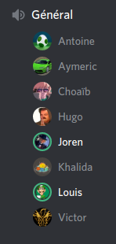
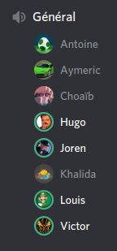
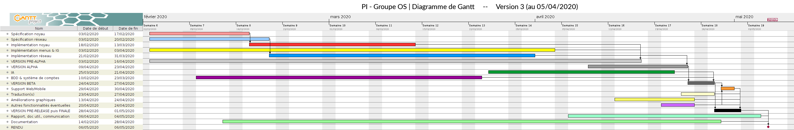

# PI - Groupe OS | Compte-rendu de réunion - 04/04/2020

- **Type  :**  Réunion hors-séance, à distance (vocal sur Discord)

- **Date  :**  Samedi 04 Avril 2020

- **Heure :**  15h15 -> 16h45 (1h30)

- **Lieu  :**  *(chacun chez soi)*

- **Membres présents :** Tout le monde

------------------------------------------------------

### [Note : Mini-réunion du 31/03]

Nous nous sommes **réunis sur Discord mardi 31 mars**, jour habituel de réunion pour le PI. Tout le monde était présent.

Au cours de cette mini-réunion, nous avons récapitulé les derniers avancements apportés au projet depuis la réunion du 28 mars. Ceux-ci étant peu nombreux, du fait du travail à faire actuellement dans d'autres UEs, nous avons discuté de peu de chose et la réunion a été très courte (15 minutes).
Nous avons néanmoins fixé la date de la prochaine réunion à samedi 04 avril.

Faire un compte-rendu uniquement pour cette réunion n'a pas été jugé pertinent, c'est pourquoi il est simplement fait mention de cette réunion dans ce compte-rendu-ci.

------------------------------------------------------

### [Ordre du jour - "Planning" de la réunion]

- **Récapituler le travail et les avancements** fait par chacun des membres

- **Faire le point** sur **l'état actuel du projet** ainsi que les **prochaines étapes**. Produire un **nouveau diagramme de Gantt** en fonction de tous ces aspects.

- **Rediscuter ensemble de certains points**, au besoin (organisation des équipes, complétion des heures...)

- Si le cas se présente, discuter des **éventuels changements dans l'organisation du projet (globalement) si la situation actuelle dûe à l'épidémie évolue**, que ce soit globalement ou pour l'un des membres de l'équipe en particulier

------------------------------------------------------

## 1. Déroulement de la réunion

### 1.1. Récapitulatif des avancements et de l'état actuel du projet

- Nous avons débuté la réunion en **récapitulant le travail et les avancements** fait par chacun des membres depuis la semaine dernière. Globalement, en raison des travaux à faire dans d'autres UEs, les avancements ont été relativement peu nombreux.

    * Louis : quelques ajouts et réglages de bugs dans le noyau

    * Choaïb : réglages de bugs dans le noyau, tests sur le jeu

    * Antoine et Choaïb se sont réunis, via Discord, pour discuter de l'IA.
    Ils ont ainsi défini une liste d'objectifs que l'IA doit suivre, et des décisions à prendre pour y arriver. Ils vont réfléchir au calcul des poids que ces décisions pourraient avoir, afin que l'IA puisse déterminer quelle stratégie adopter. Ils mettront ensuite en commun le fruit de leurs réflexions, et essaieront de partir sur un modèle intéressant.

    * Victor a apporté plusieurs améliorations à une partie de jeu en local :

        - échanges portuaires (*"4 ressources pour 1"* fonctionnel, autres échanges présentant encore des bugs mais quasi fonctionnels)

        - défausse de cartes

        - échanges entre joueurs bien avancés (cependant certains problèmes liés à l'IG demeurent, et le code va probablement devoir être retravaillé afin qu'il soit simplifié)

- Nous avons ensuite récapitulé de manière assez précise **l'état actuel du projet** : les **points implémentés mais sur lesquels il faut encore travailler**, et **ce qu'il reste à faire**.

    * **Partie locale**

        - échanges portuaires (bugs à régler)

        - échanges entre joueurs

        - fin de partie

        - utilisation des cartes de développement

        - affichage de certaines informations (routes, chevalier le plus puissant...)

        - affichage des infos de la partie dans le chat (*à voir si nous conservons l'implémentation de cette fonctionnalité*)

        - quelques ajouts relativement importants (affichage du joueur dont c'est le tour, notamment)

    * **Réseau**

        - intégration de ce module : serveur, menus, partie, chat, échanges...

        - *Remarque :* le chat vocal, dont l'implémentation a un temps été envisagée, est à priori abandonné, pour plusieurs raisons :

            * les deux principales possibilités d'implémentation s'offrant à nous sont peu pertinentes : l'une consiste à envoyer et recevoir des fichiers `.mp3` (lourd, et compliqué à faire fonctionner : les premiers tests n'ont pas été probants) ; l'autre à utiliser le moteur réseau *Photon Unity Networking* (alors que le reste du réseau a été développé sans avoir recours à ce type d'outil, dont l'utilisation a d'ailleurs posé problème dans l'un des groupes de PI)

            * de plus, après discussion, il n'a pas été jugé vraiment pertinent d'implémenter un mode vocal spécialement pour un petit jeu comme celui-ci : d'une part, la possibilité de discuter via un chat "écrit" est présente dans le jeu, et d'autre part un appel vocal via l'utilisation d'une plateforme externe (Discord, ou Skype par exemple) semble plus judicieux. Il est vrai que cela limitera les possibilités d'interactions vocales entre des joueurs jouant sur un même serveur mais ne se connaissant pas, cela dit, étant donné le périmètre du projet et le nombre de joueurs potentiels relativement restreint, cela ne pose pas vriament problème finalement.

            * enfin, nous manquerons probablement de temps pour développer et tester une telle fonctionnalité.

    * **BDD**

        - intégration au sein du jeu complet (l'intégration avec le réseau a déjà été faite)

    * **IA**

        - développement (celui-ci a déjà commencé, et sa durée dépendra également du "niveau d'intelligence" qui sera finalement donné à l'IA)

        - intégration du module au sein du jeu, en local et en ligne

---------------------------

### 1.2. Organisation et planification pour les semaines restantes

- Nous avons d'abord **récapitulé ensemble les modalités d'évaluation**, qui ont été précisées par M. CATELOIN le 1er avril, et revu ensemble quels seront les documents à rendre, leur format, les pistes envisagées.

    * Un document reprenant les modalités d'évaluations données sur Moodle a été ajouté sur notre Git, dans un dossier spécifique : `evaluation-du-projet.pdf`, qui se trouve dans `wiki/infos-officielles/`.
    D'autres documents "officiels", relatifs à l'organisation de l'UE, ont aussi été ajoutés à ce dossier.

- La **planification du travail pour les semaines à venir** a ensuite été **discutée en détail**. 
Un **nouveau diagramme de Gantt** (version 3), prenant en compte les réflexions issues de nos discussions et constituant, à priori, la dernière version de ce diagramme faite pendant le développement, a ainsi été produit.
Ce dernier est disponible en **annexe A.3.** ainsi que sur le Git (dossier `wiki/planning-gantt/`).

    * Les **nouveaux jalons** sont donc les suivants :

        - fin de semaine 16 (\~ 16/04) : version locale terminée

        - fin de semaine 17 (\~ 23/04) : réseau et BDD intégrés (le réseau va d'ailleurs commencer à être intégré progressivement dès la semaine 15, sans attendre la fin du développement de la version locale)

        - début de semaine 18 (\~ 27/04) : IA intégrée

        - reste de la semaine 18 : tests et re-tests du jeu

    * **Certains points**, qui étaient à l'origine prévus pour les "derniers jours" du projet, seront **travaillés en parallèle pendant les dernières phases de développement** :

        - la mise en place d'un support web/mobile sera à priori très rapide (de l'ordre de deux jours, le temps de pouvoir réaliser suffisament de tests), elle se fera une fois l'IA intégrée (milieu de semaine 18)

        - la traduction en anglais est déjà faite, celle dans d'autres langages sera éventuellement faite en fonction du temps qui nous restera à la fin

        - les améliorations graphiques étant à la fois moins complexes et moins chronophages que le reste du développement, celles-ci seront faites courant avril, pendant les dernières phases de développement

        - nous n'envisageons pas, à l'heure actuelle, d'implémenter d'autres fonctionnalités sur la fin du développement : nous n'aurons probablement pas le temps pour cela, et par ailleurs la dernière semaine étant consacrée aux tests, l'ajout de nouvelles fonctionnalités ne pourrait qu'augmenter potentiellement le nombre de bugs à régler.

    * Enfin, **certains travaux vont être fait en parallèle du développement au cours des semaines à venir** :

        - documentation des modules restants, révision et organisation de la documentation

        - préparation du rendu (mécanisme de build ? création auto de la documentation ? README propre)

        - préparation d'autres documents éventuels (refaire l'UML ? Diagramme de Gantt final)

        - préparation, rédaction et réalisation des documents "finaux" à rendre le 6 mai :

            * rapport final
            * documentation utilisateur
            * communication

        - préparation des deux vidéos pour le rendu le 6 mai :

            * plan, choses à dire et à montrer
            * organisation
            * discussion
            * réalisation des deux vidéos

        - préparation de la soutenance en direct avec les enseignants, le 12 mai 

            * récapitulatif de notre projet, raisons pour tel ou tel choix, phases du projet, déroulement, rôles... s'assurer que tout soit clair pour tout le monde
            * préparation des aspects techniques (plateforme de discussion, matériel nécessaire pour le direct : webcam ?)
            * préparation de la gestion des éventuels problèmes (souci de connexion, problème de micro...)

---------------------------

### 1.3. Discussions diverses

Nous avons ensuite **discuté de plusieurs points liés au projet**.

- La **complétion des heures** des membres est bien avancée. Joren a proposé à Antoine et Aymeric de les aider à remplir leurs heures.

- Nous avions prévu, comme à chaque réunion dernièrement, de discuter des **éventuels changements dans l'organisation du projet (globalement) si la situation actuelle dûe à l'épidémie évolue**, que ce soit globalement ou pour l'un des membres de l'équipe en particulier.

    * Pas de changement particulier depuis la dernière réunion

    * Les modalités d'évaluation pour l'UE ont été précisées par M. CATELOIN et nous en avons rediscuté ensemble (*cf* premier paragraphe de la section 1.2.)

- En outre, un peu de **debug** a été fait en fin de réunion, notamment en ce qui concerne les éhanges portuaires en *in-game*

- Nous nous sommes enfin donnés rendez-vous **mardi 07 avril**, pour la **prochaine réunion**, vers 14h30-15h00.

------------------------------------------------------

## 2. Bilan

### 2.1. Ce qui a été fait, les décisions prises : où nous en sommes

Cette réunion nous a permis de faire, ensemble, le **point** sur **l'état actuel du projet** et sur **ce qu'il nous reste à faire**.

Nous nous sommes entretenus sur les **modalités d'évaluation** ainsi que **l'organisation et la planification pour les prochaines semaines**, qui vont être les dernières de notre projet et seront donc cruciales.
La planification a ainsi été précisée et un **nouveau diagramme de Gantt** a vu le jour.

Certains **points divers** ont enfin été abordés.

---------------------------

### 2.2. Difficultés rencontrées

**Pas de difficulté particulière** pour cette réunion.

La nouvelle planification est définie et le nouveau diagramme de Gantt a été validé ; nous considérons que celui-ci est tenable.
Nos craintes concernent surtout la charge de travail dans les autres UEs qui pourrait être augmentée, brusquement, au cours du mois d'avril.

------------------------------------------------------

## 3. À venir : ce qui est prévu

### 3.1. Dans les prochains jours

- **Pour tout le monde** : complétion des heures, surtout pour Antoine et Aymeric (avec l'aide de Joren)

- **Pour chacun d'entre nous** : poursuite du travail dans les équipes dédiées.
Certains points spéficiques cependant :

    * Aymeric : refaire l'asset pour les échanges entre joueurs (modifier la position des ressources)

    * Planification éventuelle, au cours de la semaine à venir (semaine 15), d'une réunion entre Choaïb, Hugo, Louis, Victor et Joren pour progresser sur les échanges, qui constituent un point délicat

---------------------------

### 3.2. À la prochaine réunion (mardi 07 avril)

- **Récapituler le travail et les avancements** fait par chacun des membres

- **Faire le point** sur **l'état du projet** vis-à-vis de notre planification

- **Discuter ensemble de certains points**, éventuellement :

    * ré-organisation dans les équipes

    * changements à faire dans le développement

    * planification de réunions entre membres pour progresser sur le développement de certains points ou l'intégration de modules

    * complétion des heures

- Si le cas se présente, discuter des **éventuels changements dans l'organisation du projet (globalement) si la situation actuelle dûe à l'épidémie évolue**, que ce soit globalement ou pour l'un des membres de l'équipe en particulier

------------------------------------------------------

## A. [Annexes]

### A.1. [Capture d'écran du salon vocal de la mini-réunion du 31/03]

{width=30% height=30%}

---------------------------

\newpage

### A.2. [Capture d'écran du salon vocal de la réunion du 04/04]

{width=30% height=30%}

---------------------------

### A.3. [Diagramme de Gantt - Version 3 du 05 avril 2020]

{width=100% height=100%}

<!-- 
pour générer le doc :

pandoc 20200404-CR-equipe-OS.md -o rendus-pdf/20200404-CR-equipe-OS.pdf -V geometry:"top=2cm, bottom=2cm, left=2cm, right=2cm"
-->
