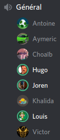
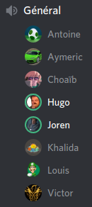

# PI - Groupe OS | Compte-rendu de réunion - 11/04/2020

- **Type  :**  Réunion hors-séance, à distance (vocal sur Discord)

- **Date  :**  Samedi 11 Avril 2020

- **Heure :**  15h10 -> 15h40 (30mn)

- **Lieu  :**  *(chacun chez soi)*

- **Membres présents :** Tout le monde

------------------------------------------------------

### [Mini-réunion du 07/04]

- Nous nous sommes **réunis sur Discord mardi 07 avril**, jour habituel de réunion pour le PI. Tous les membres de l'équipe étaient présents.

- Au cours de cette mini-réunion, nous avons récapitulé les derniers **avancements** apportés au projet depuis la réunion du 04 avril. Ceux-ci étant **peu nombreux**, du fait du travail à faire actuellement dans d'autres UEs, nous avons discuté de peu de chose et la réunion a été particulièrement courte (15 minutes).

- Cependant, **quelques points ont été abordés** en particulier :

    * Des **avancements** ont tout de même été faits :

        - Antoine: avancements sur l'IA, intégration du module avec le noyau débutée

        - Victor : lors d'une partie, les constructions faites par l'IA s'affichent désormais

    * Joren a proposé de **"faire revivre" le Trello**, afin de récapituler les différentes parties restantes pour le développement et les tâches à réaliser, ainsi que les jalons.
    Cependant, les membres de l'équipe ne considèrent pas cela comme utile et ne pensent pas utiliser le Trello même s'il est mis à jour : le diagramme de Gantt (v3) et le récapitulatif de l'avancement, fait à chaque réunion et décrit dans les comptes-rendus respectifs, sont jugés suffisants.

    * Nous avons **planifié une réunion au cours de cette semaine** (semaine 15), pour progresser dans le développement, notamment sur les échanges, qui constituent un point délicat : travailler tout en échangeant en vocal nous permettra d'être plus productifs.
    Y participeront les membres qui sont disponibles, et normalement, au moins, Choaïb, Hugo, Louis, Victor et Joren.
    Cette réunion est prévue **vendredi 10 avril après-midi**, sur Discord.

    * La complétion des heures d'Antoine et d'Aymeric sera faite avec l'aide de Joren, en vocal, respectivement jeudi et mardi de cette semaine.

- La date de la **prochaine réunion "générale"** est fixée à **samedi 11 avril**.

- Faire un compte-rendu uniquement pour cette courte réunion n'a pas été jugé pertinent, c'est pourquoi un bref récapitulatif en est simplement fait dans ce compte-rendu-ci.

------------------------------------------------------

### [Ordre du jour - "Planning" de la réunion]

- **Récapituler le travail et les avancements** fait par chacun des membres

- **Faire le point** sur **l'état du projet** vis-à-vis de notre planification

- **Discuter ensemble de certains points**, éventuellement :

    * ré-organisation dans les équipes

    * changements à faire dans le développement

    * planification de réunions entre membres pour progresser sur le développement de certains points ou l'intégration de modules

    * complétion des heures

- Si le cas se présente, discuter des **éventuels changements dans l'organisation du projet (globalement) si la situation actuelle dûe à l'épidémie évolue**, que ce soit globalement ou pour l'un des membres de l'équipe en particulier

------------------------------------------------------

## 1. Déroulement de la réunion

- **Récapitulatif du travail et des avancements** fait par chacun des membres depuis la dernière réunion du 07 avril :

    - Victor : suite de l'affichage des informations des joueurs (nombre de route, ville, colonie, nombre de fois qu'une carte chevalier a été utilisée) ; défausse fonctionnelle ; menu pour les cartes de développement jouables fonctionnel et cartes utilisables

    - Choaïb : réglages de problèmes dans le noyau, fix de fonctionnalités

    - Hugo : modification de l'asset d'affichage des ressources pour les échanges entre joueurs

    - Antoine

        * Bons avancements en IA : ajout d'une structure MVC, mise en place d'une IA de difficulté "facile"

        * Quelques modifications pour la BDD

    - Khalida : tests d'intégration du réseau et du côté client

- **Point** sur **l'état du projet** vis-à-vis de notre planification

    * Nous pouvons continuer le travail comme prévu dans la version 3 du diagramme de Gantt.

    * Ainsi, la semaine prochaine sera surtout consacrée à la finalisation du jeu local, avec comme principale fonctionnalité restant à rendre fonctionnelle les échanges entre joueurs.

- Joren a ensuite récupéré les numéros de téléphone de tous les membres de l'équipe, afin de parer à d'éventuels problèmes de connexion ou de microphone lors de la soutenance qui aura lieu le 12 mai. Si l'un d'entre nous est amené à rencontrer un problème à ce niveau, il pourra ainsi toujours communiquer et garder contact avec le chef de projet. Joren a également transmis son numéro à tout le monde.

- Les membres de l'équipe n'ont formulé **aucune autre remarque** ni fait de **demande particulière**. Le projet continue donc avec les équipes dans leur composition actuelle (*cf* section 1.2. du compte-rendu de la réunion du 28 mars), selon le planning en vigueur.

- Enfin, nous avions prévu, comme à chaque réunion dernièrement, de discuter des **éventuels changements dans l'organisation du projet (globalement) si la situation actuelle dûe à l'épidémie évolue**, que ce soit globalement ou pour l'un des membres de l'équipe en particulier.

    * **Pas de changement** particulier depuis la dernière réunion

- La **prochaine réunion** est prévue **mardi 14 avril**.

------------------------------------------------------

## 2. Bilan

### 2.1. Ce qui a été fait, les décisions prises : où nous en sommes

Ces deux petites réunions (du 07 et du 11 avril) nous ont permis de **faire le point sur les avancées**, de prévoir des réunions entre membres et de **discuter** entre nous de certains points.

La semaine à venir (semaine 16) verra le rendu de plusieurs projets que nous avons à faire dans d'autres UEs. Nous aurons donc, à partir de ce moment, **davantage de temps à consacrer au PI**. La finalisation d'un jeu jouable en local sera la priorité, elle sera poursuivie par l'intégration du réseau ainsi que l'amélioration de certains aspects graphiques du jeu.

---------------------------

### 2.2. Difficultés rencontrées

Pas de difficulté particulière pour ces deux réunions.

------------------------------------------------------

## 3. À venir : ce qui est prévu

### 3.1. Dans les prochains jours, pour chacun d'entre nous

- Poursuite du travail dans les équipes respectives.

---------------------------

### 3.2. À la prochaine réunion (mardi 14 avril)

- **Récapituler le travail et les avancements** fait par chacun des membres

- **Faire le point** sur **l'état du projet** vis-à-vis de notre planification

- **Discuter ensemble de certains points**, éventuellement :

    * ré-organisation dans les équipes

    * changements à faire dans le développement

    * planification de réunions entre membres pour progresser sur le développement de certains points ou l'intégration de modules

    * complétion des heures

- Si le cas se présente, discuter des **éventuels changements dans l'organisation du projet (globalement) si la situation actuelle dûe à l'épidémie évolue**, que ce soit globalement ou pour l'un des membres de l'équipe en particulier

------------------------------------------------------

\newpage

## A. [Annexes]

### A.1. [Capture d'écran du salon vocal de la mini-réunion du 07/04]

{width=40% height=40%}

---------------------------

### A.2. [Capture d'écran du salon vocal de la réunion du 11/04]

{width=40% height=40%}
