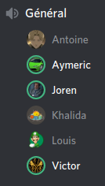
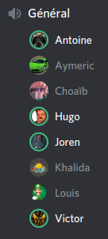

# PI - Groupe OS | Compte-rendu de réunion - 18/04/2020

- **Type  :**  Réunion hors-séance, à distance (vocal sur Discord)

- **Date  :**  Samedi 18 Avril 2020

- **Heure :**  15h05 -> 15h35 (30mn)

- **Lieu  :**  *(chacun chez soi)*

- **Membres présents :** Tout le monde

------------------------------------------------------

### [Mini-réunion du 14/04]

- Nous nous sommes **réunis sur Discord mardi 14 avril**, jour habituel de réunion pour le PI. Tous les membres de l'équipe étaient présents, à l'exception de Choaïb et d'Hugo.

- Nous avons récapitulé les derniers **avancements** apportés au projet depuis la réunion du 11 avril, ainsi que la situation actuelle. La réunion a été relativement courte (20 minutes) et nous prévoyons d'avancer davantage d'ici à la prochaine réunion : nous aurons à ce moment rendu certains projets que nous devons réaliser dans d'autres UEs, et aurons donc davantage de temps à consacrer au PI.

- Toutefois, cette mini-réunion nous a permis de **discuter de plusieurs points** :

    * Les échanges en mode local sont quasiment fonctionnels et devraient l'être d'ici à notre prochaine réunion.

    * Le gros des heures de travail (récapitulées sur le GoogleSheets) a été rempli pour l'ensemble des membres.

    * Suite aux annonces du président de la République lundi 13 avril, il est maintenant certain que nous ne reviendrons pas à l'UFR d'ici à la fin de l'année, ni pour le PI ni pour aucune autre UE. Cette situation était déjà envisagée mais nous en avons maintenant la certitude : notre projet intégrateur se finira donc totalement à distance. Nous continuons donc sur la même voie, en gardant contact via Discord et en organisant deux réunions par semaine.

- La date de la **prochaine réunion "générale"** est fixée à **samedi 18 avril**, probablement vers 15h.

- Faire un compte-rendu uniquement pour cette courte réunion n'a pas été jugé pertinent, c'est pourquoi un bref récapitulatif en est simplement fait dans ce compte-rendu-ci.

------------------------------------------------------

### [Ordre du jour - "Planning" de la réunion]

- **Récapituler le travail et les avancements** fait par chacun des membres

- **Faire le point** sur **l'état du projet** vis-à-vis de notre planification

- **Discuter ensemble de certains points**, éventuellement :

    * ré-organisation dans les équipes

    * changements à faire dans le développement

    * planification de réunions entre membres pour progresser sur le développement de certains points ou l'intégration de modules

    * complétion des heures

- Si le cas se présente, discuter des **éventuels changements dans l'organisation du projet (globalement) si la situation actuelle dûe à l'épidémie évolue**, que ce soit globalement ou pour l'un des membres de l'équipe en particulier

------------------------------------------------------

## 1. Déroulement de la réunion

- **Récapitulatif du travail et des avancements** fait par chacun des membres depuis la dernière réunion du 14 avril :

    * Victor a réussi à rendre les échanges entre joueurs, en mode local, fonctionnels. Davantage de tests vont néanmoins être menés pour s'assurer que le fonctionnement est totalement correct et détecter d'éventuels bugs à régler. En outre, Victor a également travaillé sur l'ajout de quelques animations, d'une seconde musique et de bruitages.

    * Khalida a apporté des modifications au réseau :

        - Côté serveur : sérialisation, attributs publics, ajout de fonctions, création de nouveaux évènements et regroupement

        - Côté client : évènements tels que dans *server*, corrections, quelques essais pour l'interaction avec la partie graphique

- **Point** sur **l'état du projet** actuel :

    * La réalisation d'un jeu permettant une partie en mode local totalement fonctionnelle est donc quasiment terminée.

    * Plusieurs tests seront effectués au cours des prochains jours pour détecter d'éventuels bugs, relever des points à améliorer, réfléchir à des pistes d'améliorations... en vue de mettre en place des solutions pour les corriger et améliorer l'expérience de jeu. Seront à vérifier en particulier :

        - Le bon déroulement des échanges entre joueurs

        - La fin de partie - quelques bugs ont déjà été détectés à ce niveau (évènement non appelé lors de la victoire, non-réinitialisation du contenu du noyau)

    * La semaine prochaine sera donc consacrée à davantage de tests du jeu local ainsi qu'à l'intégration du réseau au sein de la partie client.

- **Discussions sur des points divers concernant le jeu**

    * Pour l'intégration du réseau, qui constitue la prochaine grosse étape de notre travail, nous verrons si nous ajouterons ou non une nouvelle scène correspondante sur Unity. Un tel ajout poserait néanmoins un problème au niveau de la maintenabilité de notre jeu : chaque changement graphique, par exemple, devrait être effectué sur les deux scènes.
    Nous verrons quel solution mettre en place à la prochaine réunion.

    * Bien que cette décision était déjà globalement envisagée au sein du groupe, la possibilité, lors de la création d'une partie, de créer "manuellement" une partie du plateau de jeu puis de compléter les cases restantes de manière aléatoire ("*génération mi-manuelle, mi-aléatoire*", notamment évoquée dans le compte-rendu de la réunion du 18/02, section 1.1., deuxième paragraphe) est abandonnée.
    Cette fonctionnalité reste en effet délicate à mettre en place, et n'est au final pas particulièrement pertinente ni importante : la possibilité de générer le plateau entièrement à la main, ou entièrement aléatoirement, est déjà suffisante.

- D'ici à la prochaine réunion, Joren compte **travailler sur les documents finaux** et venir avec des **pistes de travail**, des plans à leur sujet. Ces idées pourront ainsi être discutées, débattues, enrichies à la prochaine réunion ; un plan et une organisation pour la réalisation de ces documents pourra alors être mise en place et le travail à leur sujet pourra démarrer de manière plus concrète.

- Les **heures** de tous les membres sont actuellement **globalement à jour** sur le GoogleSheets. Certains travaux non relevés seront probablement encore ajoutés par plusieurs membres, mais "le plus gros" est noté.
Par ailleurs, une ligne affichant, pour chaque membre, le total de son temps de travail, a été ajoutée en bas du tableau.

- Les membres de l'équipe n'ont formulé **aucune autre remarque** ni fait de **demande particulière**.

- Enfin, nous avions prévu, comme à chaque réunion dernièrement, de discuter des **éventuels changements dans l'organisation du projet (globalement) si la situation actuelle dûe à l'épidémie évolue**, que ce soit globalement ou pour l'un des membres de l'équipe en particulier.

    * **Pas de changement** particulier depuis la dernière réunion

- La **prochaine réunion** est prévue **mardi 21 avril**, à l'horaire désormais habituel (i.e. vers 15h00).

------------------------------------------------------

## 2. Bilan

### 2.1. Ce qui a été fait, les décisions prises : où nous en sommes

Ces deux réunions (du 14 et du 18 avril) nous ont permis de **récapituler les avancées**, **faire le point** sur le projet et **discuter** entre nous de certains points liés au projet et à sa réalisation.

Aucun rendu ni examen n'est prévu pour la semaine prochaine (semaine 17) : nous pourrons donc tous nous **consacrer bien davantage au projet que pendant les deux dernières semaines** écoulées.
**Seront au programme** : la mise en place d'une organisation détaillée des 15 derniers jours, des tests du jeu local, l'intégration du réseau et des autres modules (IA, BDD), l'amélioration de certains aspects du jeu (graphismes, ...), ainsi que le démarrage "concret" de la réalisation des documents finaux (planning, organisation et début du travail).

---------------------------

### 2.2. Difficultés rencontrées

**Pas de difficulté particulière** pour ces deux réunions.

------------------------------------------------------

## 3. À venir : ce qui est prévu

### 3.1. Dans les prochains jours

- Joren compte travailler sur les documents finaux pour venir avec des pistes de travail, des plans à leur sujet, afin d'en discuter à la prochaine réunion.

- Réaliser des tests sur le jeu local et noter les points problématiques

- Réfléchir à des pistes d'amélioration (graphismes, ...)

- Autrement : poursuite du travail dans les équipes respectives.

---------------------------

### 3.2. À la prochaine réunion (mardi 21 avril)

- **Récapituler le travail et les avancements** fait par chacun des membres

- **Faire le point** sur **l'état du projet** vis-à-vis de notre planification

    * Déterminer clairement où nous en sommes et ce qu'il reste à faire

    * Reprendre, ensemble, le contenu du diagramme de Gantt (v3) et clarifier, préciser l'organisation des 15 jours à venir de manière détaillée

    * Pour l'intégration du réseau : mettre en place une stratégie, plannifier les prochains jours, s'organiser. Revenir sur certaines questions (scène supplémentaire ?)

    * Pour les autres modules à intégrer (IA, BDD) : organiser également les prochains jours de manière précise

    * Discuter des documents finaux et des pistes envisagées par Joren ; mettre en place à ce sujet une organisation, un planning, afin de démarrer le travail concrètement

- **Discuter de certains points liés au projet** :

    * Faire le bilan des tests effectués sur le jeu local (notamment pour ce qui est des échanges et de la fin de partie), apporter les corrections nécessaires si besoin

    * Débriefer des réponses apportées par M. DECOR aux questions de Joren, le cas échéant

    * Discuter des pistes d'amélioration du jeu : graphismes, ergonomie, sons...

    * Revenir rapidement sur la génération "mi-manuelle, mi-aléatoire", et vérifier que la version actuelle du jeu ne souffre pas de problème si un joueur "tente" une telle génération mi-manuelle, mi-aléatoire

- **Discuter ensemble de certains points**, éventuellement et selon les besoins :

    * Mise en place d'un "calendrier" pour les 15 jours à venir ?

    * Ré-organisation dans les équipes

    * Changements à faire dans le développement

    * Planification de réunions entre membres pour progresser sur certains points en particulier

    * Complétion des heures

- Si le cas se présente, discuter des **éventuels changements dans l'organisation du projet (globalement) si la situation actuelle dûe à l'épidémie évolue**, que ce soit globalement ou pour l'un des membres de l'équipe en particulier

------------------------------------------------------

\newpage

## A. [Annexes]

### A.1. [Capture d'écran du salon vocal de la mini-réunion du 14/04]

{width=40% height=40%}

---------------------------

### A.2. [Capture d'écran du salon vocal de la réunion du 18/04]

{width=40% height=40%}
