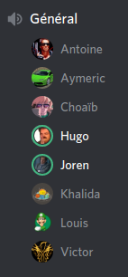

# PI - Groupe OS | Compte-rendu de réunion - 21/04/2020

- **Type  :**  Réunion hors-séance, à distance (vocal sur Discord)

- **Date  :**  Mardi 21 Avril 2020

- **Heure :**  15h05 -> 15h55 (50mn)

- **Lieu  :**  *(chacun chez soi)*

- **Membres présents :** Tout le monde

------------------------------------------------------

### [Ordre du jour - "Planning" de la réunion]

- **Récapituler le travail et les avancements** fait par chacun des membres

- **Faire le point** sur **l'état du projet** vis-à-vis de notre planification

    * Déterminer clairement où nous en sommes et ce qu'il reste à faire

    * Reprendre, ensemble, le contenu du diagramme de Gantt (v3) et clarifier, préciser l'organisation des 15 jours à venir de manière détaillée

    * Pour l'intégration du réseau : mettre en place une stratégie, planifier les prochains jours, s'organiser. Revenir sur certaines questions (scène supplémentaire ?)

    * Pour les autres modules à intégrer (IA, BDD) : organiser également les prochains jours de manière précise

    * Discuter des documents finaux et des pistes envisagées par Joren ; mettre en place à ce sujet une organisation, un planning, afin de démarrer le travail concrètement

- **Discuter de certains points liés au projet** :

    * Faire le bilan des tests effectués sur le jeu local (notamment pour ce qui est des échanges et de la fin de partie), apporter les corrections nécessaires si besoin

    * Débriefer des réponses apportées par M. DECOR aux questions de Joren, le cas échéant

    * Discuter des pistes d'amélioration du jeu : graphismes, ergonomie, sons...

    * Revenir rapidement sur la génération "mi-manuelle, mi-aléatoire", et vérifier que la version actuelle du jeu ne souffre pas de problème si un joueur "tente" une telle génération mi-manuelle, mi-aléatoire

- **Discuter ensemble de certains points**, éventuellement et selon les besoins :

    * Mise en place d'un "calendrier" pour les 15 jours à venir ?

    * Ré-organisation dans les équipes

    * Changements à faire dans le développement

    * Planification de réunions entre membres pour progresser sur certains points en particulier

    * Complétion des heures

- Si le cas se présente, discuter des **éventuels changements dans l'organisation du projet (globalement) si la situation actuelle dûe à l'épidémie évolue**, que ce soit globalement ou pour l'un des membres de l'équipe en particulier

------------------------------------------------------

## 1. Déroulement de la réunion

### 1.1. Récapitulatif du travail et des avancements fait par chacun des membres

- Khalida : rectification d'erreurs et corrections au niveau du réseau

- Victor : ajout du menu des échanges pour les parties réseau (logique encore non implémentée), début de la gestion de l'envoi du message d'un joueur dans le chat

- Louis : modifications du noyau ; encore en cours (réinitialisation après une fin de partie restant à faire)

- Joren : réflexions sur les documents finaux et le planning des 15 jours à venir (tâches, organisation, modalités), avancement sur les documents finaux (voir paragraphe 5 de la section 1.2. ci-dessous)
         

---------------------------

### 1.2. Discussions relatives à l'état du projet et notre planification

- Nous avons d'abord fait le **point sur l'état actuel du développement** :

    * Nous disposons d'un jeu permettant des parties en mode local

    * Plusieurs tests seront encore effectués pour détecter d'éventuels bugs, relever des points à améliorer, réfléchir à des pistes d'améliorations... en vue de mettre en place des solutions pour les corriger et améliorer l'expérience de jeu. Seront à vérifier en particulier :

        - Le bon déroulement des échanges entre joueurs

        - La fin de partie - quelques bugs ont déjà été détectés à ce niveau (évènement non appelé lors de la victoire, non-réinitialisation du contenu du noyau)

- Nous avons ensuite repris ensemble le diagramme de Gantt dans sa dernière version et **récapitulé les tâches qu'il nous reste à faire**, ainsi que les **dates de livraison prévues** :

    * jeu avec réseau : fin de semaine (25-26 avril)

    * module IA : samedi (25 avril)

    * jeu avec IA et BDD : début de semaine prochaine (27-28 avril)

    * traduction (si temps suffisant) : mardi-mercredi prochain (28-29 avril)

    * améliorations graphiques : jusqu'à mercredi prochain (29 avril)

    * autres fonctionnalités (si temps suffisant) : début de semaine prochaine (27-28 avril)

    * web/mobile : jeudi prochain (30 avril)

    * version finale : samedi prochain (02 mai) (nombreux tests entre mardi et samedi)\newline

    * Joren a insisté sur le fait qu'il nous faut absolument disposer de notre **version finale pour samedi prochain, 02 mai**. Cette dernière version est en effet nécessaire pour que nous puissions finaliser tous nos documents (rapport final, documentation utilisateur, communication), réaliser certaines annexes (diagramme de Gantt final, UML) et vidéos de présentation, dont le contenu dépendra de notre jeu final. Un certain temps de marge, précédent le rendu, est nécessaire pour cela.

- Concernant **l'intégration du réseau**, plus en détails :

    * Par rapport à l'interrogation de la dernière réunion, nous n'ajouterons pas de scène supplémentaire pour le réseau : un tel ajout poserait un problème au niveau de la maintenabilité de notre jeu (chaque amélioration graphique, par exemple, devrait être effectué sur les deux scènes).
    Les parties en local comme en ligne utiliseront donc la même scène mais certains éléments (menus, par exemple) seront affichés ou non en fonction du type de partie.

    * Le serveur sera *host* par l'un de nous, sur sa machine. Des tests seront effectués concernant cet aspect dans les prochains jours.

    * Afin que l'intégration puisse aboutir, des modifications seront faites sur l'IG et le noyau, mais ce ne seront pas des changements très importants à priori.

- Concernant **les autres modules à intégrer (IA, BDD)**, plus en détails :

    * La conception de l'IA mise en place nous permettra de pouvoir choisir entre plusieurs IA de difficultés différentes. L'IA "facile" étant déjà développée, nous devrions disposer *a minima* d'un niveau de difficulté.

    * La BDD est déjà liée au réseau et sera donc intégrée en même temps que ce module-ci.

- Nous avons ensuite discuté des **documents finaux** et des **pistes envisagées** par Joren à leur sujet, ainsi que des **contenus annexes à réaliser** :

    * **Trois documents "finaux" sont donc à préparer** : **rapport final, documentation utilisateur, document de communication**.
    Les détails et modalités les concernant, décrits sur Moodle et dans `evaluation-du-projet.pdf` (document disponible dans `wiki/infos-officielles/`), ont été récapitulés par Joren, qui a également présenté comment il envisageait ces documents : plan pour le rapport final, contenu et format de la documentation utilisateur et du document de communication.
    En tant que chef de projet et comme annoncé, Joren se chargera de la rédaction et de la réalisation, en grande partie, de ces documents.\newline
     **Chaque membre devra cependant rédiger**, pour le rapport final :

        - Son **bilan personnel vis-à-vis du projet** (maximum 2 pages)

        - Une **description technique du (des) module(s) sur le(s)quel(s) il aura travaillé au cours du développement** : une rédaction de cette description par les membres concernés paraît être plus pertinent

    * En dehors de ces documents, il nous faudra également réaliser :

        - Une **documentation**, du code (avec éventuellement la mise en place d'une génération via une simple commande) : il faut donc s'assurer que chaque module sera un minimum bien commenté

        - Le **diagramme de Gantt final** : celui-ci sera réalisé au cours du week-end du 02 et 03 mai (s'agissant de la version finale, il ne pourra être fait avant)

        - L'**UML de notre jeu final** : celui-ci sera réalisé au cours de la seconde moitié de la semaine prochaine (entre le 1er mai et le 03 mai à priori)

    * Nous nous pencherons également plus en détail, d'ici au rendu, sur le **rendu de notre code source** : celui-ci sera laissé à disposition sur notre Git mais nous mettrons peut être en place un dispositif permettant à chaque utilisateur de compiler le projet de manière plus simple, voire automatique (description d'étapes ? système de build ?)

    * Il nous faudra enfin **produire deux vidéos**, qui seront **réalisées avec la version finale de notre jeu** (dimanche 03 et lundi 04 mai).
    Joren réfléchira en amont au plan et au contenu de ces vidéos, éléments qui seront ensuite discutés lors d'une prochaine réunion.

    * En outre, nous devrons **préparer la soutenance** qui aura lieu la semaine du 11 mai. Cette préparation débutera après le rendu du 06 mai et interviendra donc vraisemblablement entre le 07 et le 11 mai.

- Il est impératif, là encore, que nous disposions d'une **version finale pour le samedi 02 mai**, celle-ci étant nécessaire pour que nous puissions finaliser tous nos documents et réaliser les vidéos, ce qui demandera un minimum de temps.

---------------------------

### 1.3. Discussions globales liées au projet

- Joren a fait **deux propositions relatives à l'organisation pour les deux semaines à venir**, qui constituent les jours "finaux" du projet : 

    * Mise en place, dans les jours à venir, d'un **"calendrier" pour les 15 jours à venir**, récapitulant les tâches restantes, les travaux à faire et les différentes dates de livraisons attendues. Cela prendra la forme d'un tableau ou d'un texte accessible facilement pour tous les membres, visible et mis à jour très régulièrement.

    * **Augmenter la fréquence des réunions** : passage de 2 réunions par semaine (mardi et samedi) à **3 réunions par semaine**, en moyenne tous les deux jours.
    Ces réunions ne sont pas destinées à être nécessairement longues, mais elles permettront de nous tenir au courant de nos travaux respectifs et d'échanger au sujet du projet.

- Nous comptions **débriefer des réponses** apportées par M. DECOR aux questions de Joren, posées mardi 14 avril via Discord. Aucune réponse n'ayant pour le moment été apportée, Joren compte envoyer les questions par mail à M. CATELOIN, responsable de l'UE, d'ici demain.

- Des **pistes d'amélioration du jeu** (graphismes, affichages...) ont été relevées : le travail à ce sujet n'étant pas le plus prioritaire, **nous en discuterons à la prochaine réunion**.

---------------------------

### 1.4. Discussions diverses

- Les membres de l'équipe n'ont formulé **aucune autre remarque** ni fait de **demande particulière**.\newline
Joren a rappelé qu'il reste **disponible pour toute question ou demande** relative au projet ou de manière plus générale, et ce encore davantage pour les jours à venir.

- Nous avions prévu, comme à chaque réunion dernièrement, de discuter des **éventuels changements dans l'organisation du projet (globalement) si la situation actuelle dûe à l'épidémie évolue**, que ce soit globalement ou pour l'un des membres de l'équipe en particulier.

    * **Pas de changement** particulier depuis la dernière réunion

- La **prochaine réunion** est prévue **jeudi 23 avril**, à l'horaire désormais habituel (i.e. vers 15h00).

------------------------------------------------------

## 2. Bilan

### 2.1. Ce qui a été fait, les décisions prises : où nous en sommes

Après avoir fait le point sur les derniers avancements et le jeu dont nous disposons actuellement, nous avons consacré une bonne partie de la réunion au planning des 15 prochains jours et au récapitulatif des tâches à faire : modules à finir de développer et à intégrer, documents finaux et contenus annexes à réaliser. Nous avons fini par discuter de certains points généraux liés au projet.

L'augmentation de la fréquence des réunions pour ces jours "finaux" est actée : ces dernières auront lieu en moyenne tous les 2 jours.

---------------------------

### 2.2. Difficultés rencontrées

**Pas de difficulté particulière** pour cette réunion.

------------------------------------------------------

## 3. À venir : ce qui est prévu

### 3.1. Dans les prochains jours, pour chacun d'entre nous

- Poursuivre le travail de développement et d'intégration des différents modules

- Tester le jeu et noter les points problématiques (tester notamment la génération "mi-manuelle, mi-aléatoire", et vérifier que la version actuelle du jeu ne souffre pas de problème si un joueur "tente" une telle génération)

- Pour le chef de projet : 

    * Mettre en place de manière visible et accessible un "calendrier" récapitulant les tâches restantes, les travaux à faire et les dates de livraisons attendues

    * Suivre de près les avancements

    * Avancer sur les documents finaux

---------------------------

### 3.2. À la prochaine réunion (jeudi 23 avril)

- **Récapituler le travail et les avancements** fait par chacun des membres

- **Faire le point** sur **l'état du projet** vis-à-vis de notre planification

    * Déterminer clairement où nous en sommes et ce qu'il reste à faire

    * Pour l'intégration du réseau et des autres modules : faire le point, planifier les prochains jours

    * Discuter des documents finaux et du travail fait par Joren, discuter ensemble de certains points spécifiques au besoin

- **Discuter de certains points liés au projet** :

    * Faire le bilan des tests effectués sur le jeu local (notamment pour ce qui est des échanges et de la fin de partie), apporter les corrections nécessaires si besoin

    * Débriefer des réponses apportées par M. DECOR ou M. CATELOIN aux questions de Joren, le cas échéant

    * Discuter des pistes d'amélioration du jeu (graphismes, ergonomie, sons...) et prévoir un moment pour les mettre en place

- **Discuter ensemble de certains points**, éventuellement et selon les besoins :

    * Ré-organisation dans les équipes

    * Changements à faire dans le développement

    * Planification de réunions entre membres pour progresser sur certains points en particulier

    * Complétion des heures

- Si le cas se présente, discuter des **éventuels changements dans l'organisation du projet (globalement) si la situation actuelle dûe à l'épidémie évolue**, que ce soit globalement ou pour l'un des membres de l'équipe en particulier

------------------------------------------------------

## [Annexe - Capture d'écran du salon vocal de la réunion sur Discord]

{width=40% height=40%}
<!-- syntaxe spéficique Pandoc -->

<!-- 
pour générer le doc :

pandoc 20200421-CR-equipe-OS.md -o rendus-pdf/20200421-CR-equipe-OS.pdf -V geometry:"top=2cm, bottom=2cm, left=2cm, right=2cm"
-->
