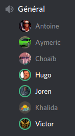

# PI - Groupe OS | Compte-rendu de réunion - 25/04/2020

- **Type  :**  Réunion hors-séance, à distance (vocal sur Discord)

- **Date  :**  Samedi 25 Avril 2020

- **Heure :**  15h10 -> 15h50 (40mn)

- **Lieu  :**  *(chacun chez soi)*

- **Membres présents :** Tout le monde

------------------------------------------------------

### [Réunion du 23/04]

- Nous nous sommes **réunis sur Discord jeudi 23 avril**. Tous les membres de l'équipe étaient présents à l'exception de Louis.

- La réunion n'a pas été très longue (25 minutes), mais nous a permis de nous tenir au courant de nos travaux respectifs et d'échanger au sujet du projet (c'est l'objectif visé par la mise en place de réunions régulières).

- Nous avons ainsi pu :

    * Récapituler les **derniers avancements** apportés au projet depuis la réunion du 21 avril :

        - Victor : réalisation du menu d'attente quand les joueurs rejoignent une même partie (logique propre : affichage du nombre joueurs connectés, etc) ; possibilité de lancer la partie si tous les joueurs sont connectés et prêts ; mais communication entre tous les clients restant à faire (par exemple : que cocher "prêt" s'affiche également chez les autres clients)

        - Khalida : suite de l'intégration du réseau, réalisation de tests au niveau serveur ; possibilité de créer une partie mais pas de la rejoindre (des tests à plusieurs sont nécessaires)

        - *Joren n'a pas pu avancer sur les documents finaux comme il le souhaitait en raison de problèmes de santé, et compte travailler là-dessus d'ici à la prochaine réunion.*

    * Discuter de l'**état actuel du projet** et de certains *bugs* présents actuellement (plusieurs ont d'ailleurs été corrigés à ce moment)

    * **Débriefer** ensemble des **réponses apportées par** notre tuteur, **M. DECOR**, aux questions de Joren.
    **L'ensemble des réponses est retranscrit en annexe** de ce compte-rendu de réunion (*cf.* **annexe A.1.**).\newline
    Plusieurs points sont toutefois à noter en particulier :

        - L'UML sera refait - au cours de la seconde moitié de la semaine prochaine (entre le 1er mai et le 03 mai à priori)
        
        - Le diagramme de Gantt sera refait également - au cours du week-end du 02 et 03 mai (s'agissant de la version finale, il ne pourra être fait avant) 

        - Nous réfléchirons davantage, éventuellement, au rendu de notre code source : celui-ci sera laissé à disposition sur notre Git mais nous mettrons peut être en place un dispositif permettant de compiler le projet de manière plus simple, voire automatique (description d'étapes ? système de build ?)

- La date de la **prochaine réunion "générale"** est fixée à **samedi 25 avril**.

- ***Note :** Suite à la fin de cette réunion, plusieurs membres ont participé à des tests du jeu concernant le réseau (création d'un serveur et connexion à ce dernier).*

- Faire un compte-rendu uniquement pour cette réunion n'a pas été jugé pertinent, c'est pourquoi un bref récapitulatif en est simplement fait dans ce compte-rendu-ci.

------------------------------------------------------

### [Ordre du jour - "Planning" de la réunion]

- **Récapituler le travail et les avancements** fait par chacun des membres

- **Faire le point** sur **l'état du projet** vis-à-vis de notre planification

    * Déterminer clairement où nous en sommes et ce qu'il reste à faire

    * Pour l'intégration du réseau et des autres modules : faire le point, planifier les prochains jours

    * Discuter des documents finaux et du travail fait par Joren à ce sujet, discuter ensemble de certains points spécifiques (au besoin), rappeler les deux parties à rédiger par les autres membres (bilan personnel de chacun et description technique de module)

- **Discuter de certains points liés au projet** :

    * Faire le bilan des tests effectués sur le jeu local (notamment pour ce qui est des échanges et de la fin de partie), apporter les corrections nécessaires si besoin

    * Discuter des problèmes liés à la création d'un serveur et à la connexion à ce dernier, ainsi que des solutions disponibles

    * Discuter de la nécessité de certains fichiers liés à *Visual Studio* (les `.sln` notamment)

    * Discuter des pistes d'amélioration du jeu (graphismes, ergonomie, sons...) et prévoir un moment pour les mettre en place

- **Discuter ensemble de certains points**, éventuellement et selon les besoins :

    * Documentation des différents modules

    * Complétion des heures

    * Ré-organisations dans les équipes

    * Changements à faire dans le développement

    * Planification de réunions pour progresser sur certains points en particulier

- Si le cas se présente, discuter des **éventuels changements dans l'organisation du projet (globalement) si la situation actuelle dûe à l'épidémie évolue**, que ce soit globalement ou pour l'un des membres de l'équipe en particulier

------------------------------------------------------

## 1. Déroulement de la réunion

### 1.1. Récapitulatif du travail et des avancements depuis la dernière réunion

- Victor : réflexions et *listing* des fonctionnalités du réseau nécessaires pour pouvoir rendre le module opérationnel au niveau de l'IG, support d'affichage de la liste de serveurs, corrections de bugs

- Khalida : développement des fonctionnalités du réseau demandées par Victor, corrections au niveau du réseau, modification de la vue (quelques modifications seront encore faites d'ici à demain)

- Antoine : 

    * BDD : quelques ajouts et corrections (notamment sur l'aspect *thread-safe*)

    * IA : l'IA moyenne est en cours de développement (beaucoup de fonctions pour le calcul des coefficients pour les décisions sont déjà faites) : il reste environ la moitié des fonctions qui appellent le noyau à implémenter

- Louis : correction de l'appel de l'évènement de victoire lors de la fin d'une partie

- Joren :

    * Mise en place d'un calendrier récapitulant les tâches restantes et les dates de livraisons attendues dans un salon dédié sur Discord, `#calendrier` (il sera tenu à jour régulièrement)

    * Travail sur les documents finaux : plan et contenu déterminés, début d'ébauches

- Par ailleurs, suite aux tests du jeu concernant le réseau ayant été réalisés jeudi 23/04, il est désormais possible de créer un serveur et, pour d'autres joueurs, de s'y connecter. Davantage de tests seront encore réalisés à ce niveau.

---------------------------

### 1.2. Discussions concernant l'état du projet et le planning

- **Point** sur **l'état du projet**

    * L'intégration du réseau est en cours.

    * L'IA est encore en cours de développement pour ce qui est de la difficulté moyenne. L'IA facile est finie, il reste à la debugger.

    * La BDD et l'IA vont être intégrées en début de semaine prochaine (27-28 avril).

    * De nombreux tests seront réalisés entre mardi et vendredi avant que la version finale du jeu ne "sorte" le week-end prochain (02 mai).

- Le **travail et les réflexions sur les documents finaux avancent** et vont continuer pendant les jours à venir.

- Afin d'avancer au niveau de l'intégration du réseau et de faire plusieurs tests, il a été décidé d'organiser une **réunion dimanche 26 avril** (voir section 1.4. de ce CR).

- Le **calendrier mis en place sur Discord** (*cf.* le salon `#calendrier`) nous permettra de garder en tête les dates importantes et le travail qu'il nous reste à réaliser pour les jours à venir.

---------------------------

### 1.3. Discussions globales liées au projet

- **Au sujet du réseau** :

    * Les problèmes rencontrés lors des tests ont été réglés : la création d'un serveur et la connexion à ce dernier est désormais possible. Davantage de tests seront encore réalisés à ce niveau.

    * À priori, Choaïb *hostera* le serveur pour jouer.

    * Nous avons discuté des fichiers qui ont posé problème lors des tests, liés à *Visual Studio* (les `.sln` notamment), et qui semblent être nécessaires pour pouvoir créer un serveur.\newline
    Des investigations seront faites à ce sujet :

        - la présence des fichiers `.sln` chez un utilisateur, sans pour autant qu'il n'ai *Visual Studio* d'installé, est-elle nécessaire et/ou suffisante pour pouvoir créer un serveur ?

        - si la présence de certains fichiers ou de *Visual Studio* s'avère être nécessaire pour pouvoir réaliser certaines opérations du jeu (telle que la création d'un serveur) : il nous faudra ajouter des explications dans le jeu et dans le README à ce sujet.

- Les **pistes d'amélioration du jeu** envisagées par Joren seront éventuellement mises en place avec Victor lors de la réunion du dimanche 26 avril, en fonction de comment se déroulent les tests.

- Quelques **rappels** ont enfin été faits par Joren :

    * Les **différents modules** doivent être **commentés** d'ici à **vendredi prochain (1er mai)** : les commentaires ne doivent pas être nécessairement longs et verbeux, mais doivent contenir un minimum d'explications pour les fonctions et les classes les plus importantes

    * Chaque membre doit s'assurer de **compléter ses heures de travail** sur le *GoogleSheets* : le document de suivi doit être **totalement complété pour le 06 mai**.

---------------------------

### 1.4. Discussions diverses

- Les membres de l'équipe n'ont formulé **aucune autre remarque** ni fait de **demande particulière**.\newline
Joren a rappelé qu'il reste **disponible pour toute question ou demande** relative au projet ou de manière plus générale, et ce encore davantage pour les jours à venir.

- Nous avions prévu, comme à chaque réunion dernièrement, de discuter des **éventuels changements dans l'organisation du projet (globalement) si la situation actuelle dûe à l'épidémie évolue**, que ce soit globalement ou pour l'un des membres de l'équipe en particulier.

    * **Pas de changement** particulier depuis la dernière réunion

- **Concernant les prochaines réunions** :

    * Une réunion consacrée au **développement du jeu et à des tests**, plus spécifiquement concernant les parties en ligne, est prévue **dimanche 26 avril** après-midi, **à partir de 14h30**. La plupart des membres ont fait part de leur intention d'y participer.

    * La **prochaine réunion "officielle"** aura quant à elle lieu **lundi 27 avril**, à partir de **15h00**.

------------------------------------------------------

## 2. Bilan

### 2.1. Ce qui a été fait, les décisions prises : où nous en sommes

La petite réunion du 23/04 nous a permis de **discuter des avancements et de l'état du projet**, ainsi que de **débriefer** ensemble des réponses apportées par M. DECOR aux questions de Joren. Nous avons alors fait des **tests** ensemble au niveau du réseau, suite à la fin de cette réunion.

Celle du 25/04 a été l'occasion de **récapituler les derniers travaux** fait sur le projet ainsi que la **situation actuelle** (jeu, planning et documents finaux).
Nous avons ensuite discuté de **certains points** (réseau et tests, rappels de tâches à effectuer pour tous les membres...).

Les **prochaines réunions** sont prévues dimanche 26 avril (développement et tests pour les parties en ligne) et lundi 27 avril (réunion "officielle" classique).

---------------------------

### 2.2. Difficultés rencontrées

**Pas de difficulté particulière** pour ces deux réunions.

------------------------------------------------------

## 3. À venir : ce qui est prévu

### 3.1. Dans les prochains jours, pour chacun d'entre nous

- Régler certains bugs :

    * non-réinitialisation du noyau entre deux parties de jeu

    * *bug* lors de l'utilisation d'une carte développement "création de route"

- Poursuivre le travail de développement et d'intégration des différents modules

- Tester le jeu et noter les éventuels points problématiques.\newline
Faire des tests au sujet de la création/connexion à un serveur (fichiers `.sln` et installation de *Visual Studio* suffisants et/ou nécessaires ?) (*cf.* section 1.3. de ce CR, premier paragraphe, troisième point)

- Pour tous les membres :

    * Tenir à jour le suivi des heures de travail sur le *GoogleSheets*

    * Commenter le code des différents modules

- Pour le chef de projet : 

    * Suivre de près les avancements et tenir le calendrier (sur Discord) à jour

    * Avancer sur les documents finaux

---------------------------

### 3.2. À la prochaine réunion (lundi 27 avril)

- **Récapituler le travail et les avancements** fait par chacun des membres, en ce qui concerne le jeu en lui-même ainsi que les documents finaux

- **Faire le point** sur **l'état du projet** vis-à-vis de notre planification

    * Déterminer où nous en sommes et ce qu'il reste à faire (concernant les modules et leur intégration), organiser les prochains jours, faire le point sur le calendrier (sur Discord)

    * Si nécessaire : faire certains choix et changer les prévisions en fonction de l'avancement, affecter des tâches spécifiques à certains membres

    * Discuter des documents finaux et du travail fait par Joren à ce sujet, discuter ensemble de certains points spécifiques (au besoin), rappeler les deux parties à rédiger par les autres membres (bilan personnel de chacun et description technique de module)

- **Discuter de certains points liés au projet** :

    * Revenir sur les bugs et s'ils ont été corrigés ou non (non-réinitialisation du noyau, utilisation d'une carte développement "création de route")

    * Faire le bilan des tests effectués et apporter les corrections nécessaires si des problèmes ont été rencontrés :

        - sur le jeu local (échanges, fin de partie, génération "mi-manuelle, mi-aléatoire")

        - sur le jeu en ligne, notamment par rapport à la création/connexion à un serveur (fichiers `.sln` et installation de *Visual Studio* suffisants et/ou nécessaires ?) (*cf.* section 1.3. de ce CR, premier paragraphe, troisième point)

    * Discuter des pistes d'amélioration du jeu (graphismes, ergonomie, sons...) et prévoir un moment pour les mettre en place

- **Discuter ensemble de certains points**, éventuellement et au besoin :

    * Documentation des différents modules

    * Complétion des heures de travail sur le *GoogleSheets*

    * Planification des prochaines réunions pour progresser sur certains points en particulier

    * Rédaction du bilan personnel et de la description des modules

- Si le cas se présente, discuter des **éventuels changements dans l'organisation du projet (globalement) si la situation actuelle dûe à l'épidémie évolue**, que ce soit globalement ou pour l'un des membres de l'équipe en particulier

-------------------------------------------------------

## A. [Annexes]

### A.1. [Réponses de M. DECOR aux questions de Joren - 22/04]

#### Soutenance

*Pour la soutenance, la plateforme n'a pas encore été formellement définie mais on restera sans doute sur discord. La soutenance en elle-même sera en visio mais les étudiants qui n'en ont pas (ou qui n'ont pas une connexion suffisante), pourront être en vocal, voire en texte seul dans le pire des cas. La situation étant particulière et non prévue, nous serons conciliants sur les limitations techniques que rencontrent les équipes. La durée n'est pas arrêtée mais, comme il ne reste que la séance de questions/réponses, je dirais qu'il faut compter 10-15 min par équipe.*

#### Documents finaux

*Le dossier de communication est libre. Les seules contraintes sont
1) qu'il doit donner envie aux gens de jouer à votre jeu
2) la forme doit être adaptée au public visé et, éventuellement, au support de diffusion (par exemple, une pub télé est plus courte qu'une vidéo sur youtube)
En dehors d'éléments évidents tels que le nom du jeu, il n'y a rien d'obligatoire.*

*La seule obligation autre est plus administrative: si vous utilisez des images ou, de façon générale, des ressources ne vous appartenant pas, il faudra les créditer (dans le rapport, pas sur le document de communication même).*

*Il n'y a pas de taille limite mais, pour des raisons logistiques, ce serait bien de ne pas trop dépasser les 10-15Go pour l'ensemble.*

#### Documentation du code source

*Pour la documentation, c'est bien une description assez générale qu'on recherche.
C'est plutôt l'architecture globale qui nous intéresse et non le fonctionnement individuel de chacune des méthodes/fonctions.*

#### Autres documents à réaliser

*Oui pour une version définitive de l'UML (et oui aussi pour le diagramme de Gantt actualisé).*

#### Rendu du code et modifications ultimes

*Pour le code source, vous n'avez à faire aucune démarche particulière, le git suffit. Vous avez parfaitement le droit de modifier votre code jusqu'à la soutenance mais vous aurez peu de temps dans la séance pour faire valoir ces modifications. Si ça devait arriver, il vaut mieux se concentrer sur des éléments que vous pouvez présenter rapidement à l'oral (éventuellement avec écran partagé).*

---------------------------

\newpage

### A.2. [Capture d'écran du salon vocal de la réunion du 23/04]

{width=40% height=40%}

---------------------------

### A.3. [Capture d'écran du salon vocal de la réunion du 25/04]

{width=40% height=40%}
