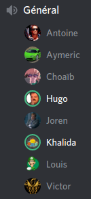
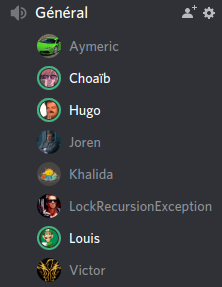
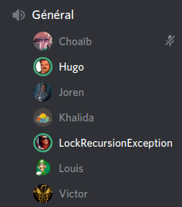
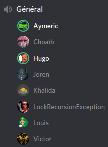
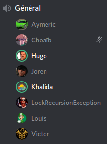
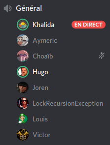
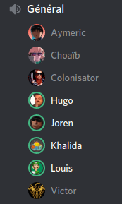

# PI - Groupe OS | Compte-rendu de réunion - 03/05/2020

- **Type  :**  Réunions hors-séance, à distance (vocal sur Discord)

- **Date  :**  **7 réunions entre le dimanche 26 avril et le dimanche 03 mai**

- **Heure :**  *(variables)*

- **Lieu  :**  *(chacun chez soi)*

- **Membres présents :** Tout le monde pour la plupart du temps

------------------------------------------------------

### 1. Récapitulatif des réunions successives de cette semaine

- Nous nous sommes tous **réunis sur Discord** plusieurs fois au cours des derniers jours, afin de continuer à avancer sur le projet, tester et intégrer ensemble *(les horaires sont celles pour lesquels une majorité de membres étaient présents ; certains étaient présents parfois avant, parfois après ces horaires)* :

    * **dimanche 26 avril** pendant l'après-midi, entre 14h30 et 19h00 ;

    * **lundi 27 avril** pendant l'après-midi, entre 14h45 et 18h45 ;

    * **mardi 28 avril** pendant l'après-midi, entre 14h00 et 18h15 ;

    * **mercredi 29 avril** de 10h00 à 13h00 et de 14h30 à 19h00 ;

    * (pas de réunion jeudi 30 avril) ;

    * **vendredi 1er mai** de 13h00 à 19h30 ;

    * **samedi 02 mai** de 11h15 à 20h00 ;

    * **dimanche 03 mai** de 11h00 à 20h30.

- À chaque "session" de réunion, la **totalité des membres de l'équipe ont été présents**. \newline
La réunion de mardi constitue la seule exception notable ; Aymeric ne pouvait en effet pas être présent du fait qu'il avait un examen en fin d'après-midi ce jour-ci. \newline
L'heure d'arrivée de chaque membre différait en fonction de sa disponibilité et de ses autres obligations, et plusieurs pauses étaient évidemment faites au cours des réunions, ce qui fait que l'intégralité des membres n'étaient pas présents au complet tout du long ; mais **la plupart des membres étaient présents pendant une grande partie de chaque réunion**.

- Ces réunions successives nous ont permis d'**apporter à notre jeu des améliorations conséquentes**. Notre travail s'est axé sur plusieurs aspects :

    * tests d'un maximum d'éléments et fonctionnalités du jeu ;

    * recherche et résolution de bugs et autres erreurs de fonctionnement ;

    * *listing* et mise en place des idées d'améliorations pouvant être apportées au jeu dans son ensemble : interface graphique, *assets*, effets sonores, cohérence de l'interface et du *look and feel*, petits détails, fautes... afin d'améliorer au mieux l'expérience utilisateur ;

    * suivi des bugs connus, des éléments à tester et des idées d'améliorations par Joren afin de ne rien oublier à ce niveau ;

    * suite de l'intégration des modules réseau, IA et BDD au sein du jeu.

- Lister en détail tous les *bugs* rencontrés et corrigés ainsi que les améliorations faites n'étant pas particulièrement judicieux, **voici un récapitulatif** :

    * Jeu local : nombreux *fixs* et ajouts, tests, recherche de *bugs*, correction et vérification, recherche et *listing* d'ajouts et améliorations possibles, ajout des-dites améliorations

    * IA : module terminé et intégré, nombreux tests et corrections 

    * BDD : fonctionnement désormais *thread-safe* ; réalisation de modifications nécessaires au niveau du réseau

    * Réseau : intégration quasi-totale et tests

- Au cours de chaque réunion, nous avons fait à une ou plusieurs reprises un **point de manière plus "classique"** (bilan des avancements, point sur le calendrier, décisions pour la suite du développement), après quoi nous nous remettions au travail de développement du jeu et d'intégration.

- Au vu de la fréquence des réunions et du nombre d'avancements réalisés, **faire un compte-rendu unique pour chaque réunion aurait été aussi inutilement verbeux que peu pertinent**, car bon nombre de problèmes rencontrées lors d'une réunion *n* étaient corrigés lors de la réunion *n+1* ou *n+2*, ce qui aurait rendu le récapitulatif du CR concerné aussitôt caduc. \newline
Voilà pourquoi cet **unique compte-rendu**, résumant l'ensemble du travail effectué, a été réalisé.

- Un **suivi précis** des tests à faire, éléments à ajouter, avancements réalisés, améliorations possibles, problèmes rencontrés, bugs à résoudre et corrections à tester a toutefois été réalisé par le chef de projet tout au long de la semaine.

------------------------------------------------------

## 2. Bilan

### 2.1. Ce qui a été fait, les décisions prises : où nous en sommes

Nous sommes **satisfaits du travail réalisé cette semaine par nous tous**, et disposons désormais d'un **jeu bien plus solide** sur bon nombre de points. Les réunions ont été productives et le travail en groupe, en vocal, s'est bien passé.

L'interface graphique a fait l'objet de nombreuses améliorations, beaucoup de corrections ont été apportées au fonctionnement du jeu, il est désormais possible de jouer avec des *bots*... notre jeu a été considérablement enrichi depuis les deux dernières semaines. Une partie en ligne est presque intégralement possible, reste à voir si de telles parties seront disponibles sur tous les systèmes d'exploitation.

---------------------------

### 2.2. Difficultés rencontrées

Si des difficultés ont été rencontrées pendant le développement et l'intégration sur des aspects "techniques" (bugs rencontrés, crashs, points ne fonctionnant pas bien), il n'y a eu aucun problème "humain" au cours de ces réunions, comme pendant le reste de notre projet d'ailleurs.

L'ensemble de l'équipe a été extrêmement impliquée au cours de cette dernière semaine de développement et chaque membre a fait preuve d'un bel investissement, en participant à chaque réunion ; que ce soit pour développer, rechercher des améliorations, participer à l'intégration, faire le point, tester de nombreuses fonctionnalités, donner un avis ou apporter de l'aide à d'autres membres.

\newpage

------------------------------------------------------

## 3. À venir : ce qui est prévu

### 3.1. Dans les prochains jours, pour chacun d'entre nous

- Finalisation de notre jeu

- Finalisation des "documents finaux" (rapport, documentation, communication)

- Finalisation de tous autres documents et travaux liés au rendu (README, suivi des heures...)

- Réalisation des vidéos de soutenance

- Rendu final du projet le 06 mai au soir.

---------------------------

### 3.2. Après le 06 mai

- Préparation, vraisemblablement entre le 07 et le 10 mai, de la soutenance qui aura lieu la semaine du 11 mai.

------------------------------------------------------

## [Annexes]

### A.1. [Capture d'écran du salon vocal de la réunion du 26/04]

{width=40% height=40%}

\newpage

---------------------------

### A.2. [Capture d'écran du salon vocal de la réunion du 27/04]

{width=40% height=40%}

---------------------------

### A.3. [Capture d'écran du salon vocal de la réunion du 28/04]

{width=40% height=40%}

\newpage

---------------------------

### A.4. [Capture d'écran du salon vocal de la réunion du 29/04]

{width=40% height=40%}

---------------------------

### A.5. [Capture d'écran du salon vocal de la réunion du 01/05]

{width=40% height=40%}

\newpage

---------------------------

### A.6. [Capture d'écran du salon vocal de la réunion du 02/05]

{width=40% height=40%}

---------------------------

### A.7. [Capture d'écran du salon vocal de la réunion du 03/05]

{width=40% height=40%}
